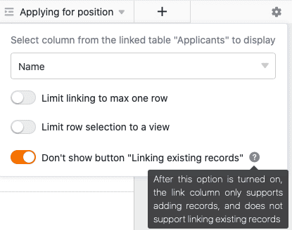

SeaTable permite enlazar información de diferentes tablas. Para ello, utilice el tipo de columna **Enlace a otras entradas**.

## Para enlazar dos tablas

1. Cree una nueva columna y seleccione el tipo de columna **Enlace a otras entradas**.
2. Dale un **nombre** a la columna.
3. En **Seleccionar tabla para vincular**, seleccione la tabla cuyas entradas desea vincular a la tabla actual.
4. Haga clic en **Enviar**.
5. El contenido de la nueva columna sigue vacío. Para rellenarla, puede **enlazar entradas existentes** o **añadir nuevas filas**.

En cuanto las tablas estén enlazadas, podrá consultar la información de las entradas enlazadas a través del **cuadro de diálogo de enlace**. Para ello, haga clic en el **símbolo de flecha doble** en una **celda de** la columna de enlace o **haga doble clic**. Las entradas **enlazadas** se enumeran en el diálogo de enlace que se abre. Haga clic en una entrada para ver **los detalles de la fila** en una ventana adicional.

## Vincular entradas existentes

1. Haga clic en una **celda** de la **columna de enlaces** y, a continuación, en el **símbolo más** que aparece.
2. Ahora aparecen las **filas** disponibles **de la** tabla vinculada. Seleccione la(s) fila(s) que desea vincular a la fila de su tabla actual.
3. En la columna de enlaces, cada línea se muestra inmediatamente **como una entrada enlazada**.



Mediante la **función de búsqueda integrada** en el cuadro de diálogo de enlace, puede buscar las entradas de la tabla enlazada para encontrar rápidamente la fila deseada.



## Añadir nueva fila

Incluso puede añadir una **nueva fila** a una tabla **vinculada** a través del diálogo de vínculos sin tener que cambiar a esta tabla. La fila se añade entonces a la tabla enlazada entre los registros existentes y se muestra como una entrada enlazada en la columna de enlace de la tabla abierta.

1. **Haga doble clic** en la **celda** de una **columna de enlace** o en el **símbolo azul de la doble flecha** para abrir el cuadro de diálogo de enlace.

2. Haga clic en **Añadir fila**.

3. En la ventana que se abre, rellene las distintas **columnas de la tabla**.

4. Haga clic en **Enviar** para crear la nueva fila.

5. La **nueva fila** se añade automáticamente a la **tabla vinculada** y se muestra en la tabla actualmente abierta como una **entrada vinculada** en la columna de enlace.

## Editar entradas existentes de una tabla vinculada

1. Haga clic en una **celda** de la columna de enlaces.
2. Haga clic en la **entrada vinculada** que desee editar.
3. Se abrirán los **detalles de la línea**. Realice allí los **cambios** deseados.
4. **Cierre** la ventana para **guardar** los cambios.

## Eliminar enlaces

Puede eliminar las entradas enlazadas en una columna de enlaces con sólo unos clics. Para ello, basta con abrir el **diálogo de** enlaces de la columna de enlaces correspondiente y hacer clic en el **símbolo X situado** a la derecha de la entrada deseada.



## Configuración de la columna de enlaces

Una columna de enlace le permite realizar y cambiar varios ajustes muy fácilmente. Para ello, haga clic en el **símbolo** triangular **desplegable de** la columna de enlace en la cabecera de la tabla y, a continuación, en **Ajustes**.

### Selección de la columna vinculada de la tabla vinculada

En el menú desplegable puede seleccionar primero la **columna de la tabla vinculada** cuyas **entradas** deben mostrarse en la columna del vínculo.

### Limitar los enlaces a una fila

Activando el control deslizante correspondiente, puede limitar la vinculación a un **máximo de una fila**. Si este ajuste está activo, sólo se podrá añadir **una entrada enlazada** en cada celda de la columna de enlace.

Si ya ha añadido una entrada vinculada a una celda, ya **no** se muestran las opciones para añadir más entradas.

Esta configuración puede ser útil, por ejemplo, si una factura debe vincularse con el pedido correspondiente de otra tabla, es decir, si los registros de datos vinculados forman **pares** lógicos. En este caso, añadir más enlaces podría llevar a confusión y afectar negativamente a los procesos de trabajo.

### Restringir los enlaces a una vista

Activando esta opción, puede restringir los enlaces a **una** vista de la tabla enlazada. Para ello, defina una vista previamente definida **de** la tabla vinculada. En la columna de enlaces **sólo** podrá enlazar las entradas de esta vista. **No** es posible vincular entradas de otras vistas.

Este ajuste es especialmente útil en [vistas filtradas](#7-toc-title), este ajuste puede ser útil si desea enlazar **entradas individuales** en sus tablas.

### Impedir la vinculación de entradas existentes

En la configuración de una columna de enlace, también puede impedir la vinculación de entradas existentes activando el control deslizante correspondiente. Si el control deslizante está **activado**, la columna de enlace correspondiente **sólo** admite la adición de **nuevas filas** o entradas.

Las entradas existentes en la tabla enlazada ya **no** podrán enlazarse en la columna. Sin embargo, las entradas ya enlazadas en la columna **no se verán afectadas** por este ajuste.

## Opciones de visualización del diálogo de enlaces

En el diálogo de enlaces de una columna de enlaces, también están disponibles varias opciones de visualización.

### Ajustar el tamaño de la ventana

Para tener todas las entradas enlazadas de un vistazo, puede ajustar el **tamaño** del cuadro de diálogo de enlaces. Para ello, basta con mover el ratón sobre uno de los bordes exteriores hasta que el cursor se convierta en una **flecha doble** y arrastrar el borde en la dirección deseada manteniendo pulsado el botón del ratón.

### Ajustar el ancho de columna

Para que quepan más entradas de columnas de las filas enlazadas en la ventana, también puede ajustar la **anchura de** las **columnas** mostradas en el diálogo de enlace. Para ello, mueva el ratón sobre el **área entre dos nombres de columna** hasta que el cursor se convierta en una **flecha doble** y arrastre la línea divisoria invisible hacia la izquierda o la derecha mientras mantiene pulsado el botón del ratón hasta que haya alcanzado la **anchura de columna** deseada.

### Ocultar columnas

Para que el diálogo de enlace sea aún más claro, puede ocultar cualquier número de columnas de las entradas enlazadas haciendo clic en el **símbolo del ojo**. Se abre una ventana en la que puede **(des)activar** las columnas individuales con controles deslizantes. En consecuencia, las columnas se ocultan o se muestran en la vista general de las entradas enlazadas.

### Ordenar entradas

Haga clic en los **símbolos de flecha para** **ordenar** las entradas enlazadas en el diálogo de enlaces. Utilice esta función, por ejemplo, para mostrar las entradas enlazadas en orden alfabético basándose en una columna de texto o para ordenarlas según otra columna.



## Preguntas frecuentes

La columna Enlace está disponible en todas las suscripciones de SeaTable. Sin embargo, probablemente esté intentando cambiar el tipo de columna de una columna existente. Cuando [cambie]() el tipo de columna, el tipo de columna Enlace a **otras entradas** _no_ estará disponible. En su lugar, cree una **nueva columna** y se le ofrecerá el tipo de columna deseado.


