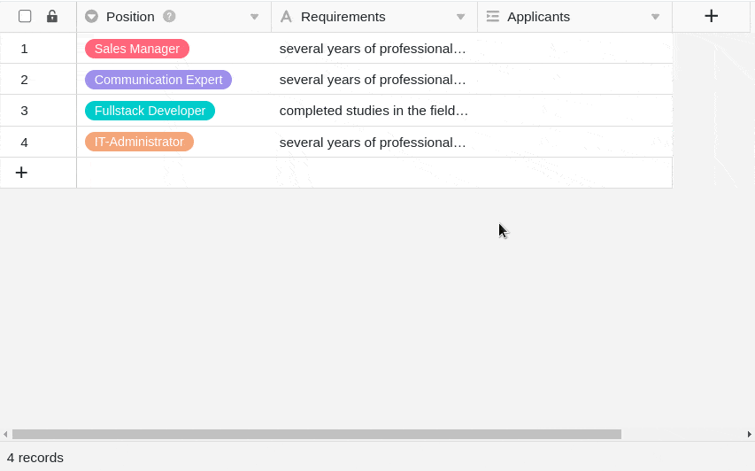
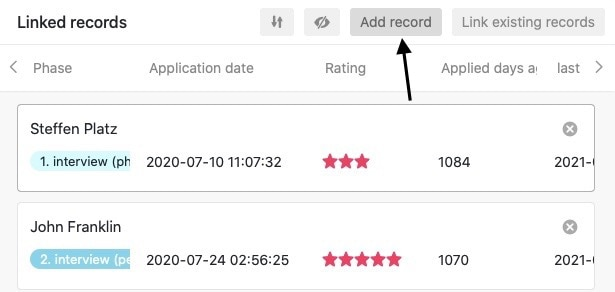

SeaTable permite-lhe ligar informações de diferentes tabelas. Para tal, utilizar o tipo de coluna **Link para outras entradas**.

## Para ligar duas tabelas

1. Criar uma nova coluna e selecionar o tipo de coluna **Ligação a outras entradas**.
2. Dê um **nome** à coluna.
3. Em **Select table for linking**, seleccione a tabela cujas entradas pretende ligar à tabela actual.
4. Clique em **Submeter**.
5. O conteúdo da nova coluna ainda está vazio. Para o preencher, pode **ligar entradas existentes** ou **adicionar novas linhas**.

Assim que as tabelas são ligadas, é possível chamar as informações das entradas ligadas através do **diálogo de ligação**. Para isso, clique no **símbolo de seta dupla** numa **célula da** coluna de ligação ou **faça duplo clique**. As **entradas ligadas** são listadas na caixa de diálogo de ligação que se abre. Clique numa entrada para ver **os detalhes da linha** numa janela adicional.

## Ligar entradas existentes

1. Clique numa **célula da** **coluna de ligação** e, em seguida, clique no **símbolo de mais** que aparece.
2. Agora, as **linhas** disponíveis **da tabela ligada** são listadas. Seleccione a(s) linha(s) que pretende ligar à linha da sua tabela atual.
3. Na coluna de ligação, cada linha é imediatamente apresentada **como uma entrada ligada**.



Utilizando a **função de pesquisa integrada** no diálogo de ligação, é possível pesquisar as entradas da tabela ligada para encontrar rapidamente a linha desejada.



## Adicionar nova linha

É até possível adicionar uma **nova linha** a uma **tabela ligada** através do diálogo de ligação sem ter de mudar para essa tabela. A linha é então adicionada à tabela ligada entre os registos existentes e exibida como uma entrada ligada na coluna de ligação da tabela aberta.

1. Faça **duplo clique** na **célula de** uma **coluna de ligação** ou clique no **símbolo de seta dupla** azul para abrir a caixa de diálogo de ligação.

2. Clique em **Adicionar linha**.

3. Na janela que se abre, preencha as várias **colunas da tabela**.

4. Clique em **Submeter** para criar a nova linha.

5. A **nova linha** é automaticamente adicionada à **tabela ligada** e exibida na tabela atualmente aberta como uma **entrada ligada** na coluna de ligação.

## Editar entradas existentes de uma tabela ligada

1. Clique numa **célula da** coluna de ligação.
2. Clique na **entrada associada** que pretende editar.
3. **Os detalhes da linha** abrem-se. Efectue aí as **alterações** pretendidas.
4. **Feche** a janela para **guardar** as alterações.

## Remover ligações

Pode remover entradas ligadas numa coluna de ligação com apenas alguns cliques. Para o fazer, basta abrir a caixa de **diálogo** de ligação **da** coluna de ligação correspondente e clicar no **símbolo X à** direita da entrada pretendida.



## Definições da coluna de ligações

Uma coluna de ligação permite-lhe fazer e alterar várias definições muito facilmente. Para o fazer, clique no **símbolo** triangular **do menu pendente da** coluna de ligação no cabeçalho da tabela e, em seguida, em **Definições**.

### Seleção da coluna ligada a partir da tabela ligada

No menu pendente, é possível selecionar primeiro a **coluna da tabela ligada** cujas **entradas** devem ser apresentadas na coluna de ligação.

### Restringir as ligações a uma linha

Ao ativar a barra deslizante correspondente, pode limitar a ligação a um **máximo de uma linha**. Se esta definição estiver ativa, só pode ser adicionada **uma entrada ligada** em cada célula da coluna de ligação.

Se já tiver adicionado uma entrada ligada a uma célula, as opções para adicionar mais entradas já **não** são apresentadas.

Esta definição pode ser útil, por exemplo, se uma fatura tiver de ser ligada à encomenda correspondente de outra tabela - ou seja, se os registos de dados ligados formarem **pares** lógicos. Neste caso, acrescentar mais ligações pode gerar confusão e afetar negativamente os processos de trabalho.

### Restringir as ligações a uma vista

Ao ativar esta definição, é possível restringir as ligações a **uma vista da** tabela ligada. Para isso, o usuário define uma **visão** previamente definida **da** tabela ligada. Na coluna de ligação, é possível ligar **apenas** as entradas dessa visão. A ligação de entradas de outras visões deixa **de** ser possível.

Esta definição é particularmente útil em [vistas filtradas](#7-toc-title), esta definição pode ser útil se pretender ligar **entradas individuais** nas suas tabelas.

### Impedir a ligação de entradas existentes

Nas definições de uma coluna de ligação, também é possível impedir a ligação de entradas existentes, activando um cursor correspondente. Se a barra deslizante estiver **activada**, a coluna de ligação correspondente **apenas** suporta a adição de **novas linhas** ou entradas.

As entradas existentes na tabela ligada **não** podem mais ser ligadas na coluna. As entradas que já foram ligadas na coluna, no entanto, não são **afectadas** pela definição.

## Opções de visualização da caixa de diálogo da ligação

No diálogo de ligação de uma coluna de ligação, estão também disponíveis várias opções de visualização.

### Ajustar o tamanho da janela

Para ter todas as entradas ligadas num relance, pode ajustar o **tamanho da** janela de diálogo de ligação. Para tal, basta passar o rato sobre uma das margens exteriores até o cursor se transformar numa **seta dupla** e arrastar a margem na direção pretendida, mantendo o botão do rato premido.

### Ajustar a largura da coluna

Para encaixar mais entradas de coluna das linhas ligadas na janela, também é possível ajustar a **largura das** **colunas** exibidas na caixa de diálogo de ligação. Para isso, mover o mouse sobre a **área entre dois nomes de colunas** até que o cursor se transforme em uma **seta dupla** e arrastar a linha de limite invisível para a esquerda ou para a direita, mantendo o botão do mouse pressionado, até atingir a **largura de coluna** desejada.

### Ocultar colunas

Para tornar o diálogo de ligação ainda mais claro, pode ocultar qualquer número de colunas das entradas ligadas, clicando no **símbolo do olho**. Abre-se uma janela na qual é possível **(des)ativar** as colunas individuais com barras deslizantes. De acordo com isso, as colunas são ocultadas ou exibidas na síntese das entradas ligadas.

### Ordenar entradas

Clicar nos **símbolos de seta para** **ordenar** as entradas ligadas na caixa de diálogo de ligação. Utilize esta função, por exemplo, para apresentar as entradas ligadas por ordem alfabética com base numa coluna de texto ou para as ordenar de acordo com outra coluna.



## Perguntas mais frequentes

A coluna Ligação está disponível em todas as subscrições do SeaTable. No entanto, é provável que esteja a tentar alterar o tipo de coluna de uma coluna existente. Quando [altera]() o tipo de coluna, o tipo de coluna Ligação a **outras entradas** _não_ está disponível. Em vez disso, crie uma **nova coluna** e ser-lhe-á oferecido o tipo de coluna pretendido.


