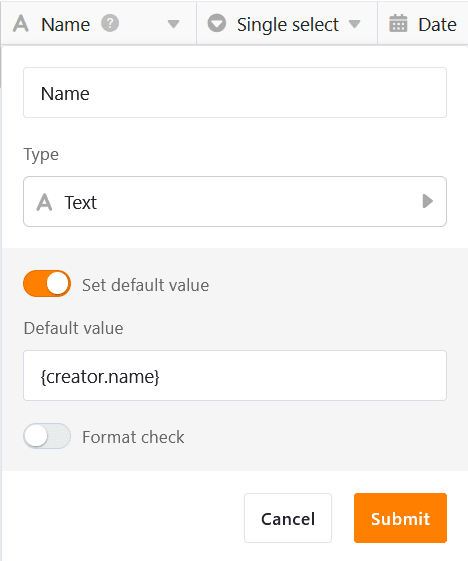
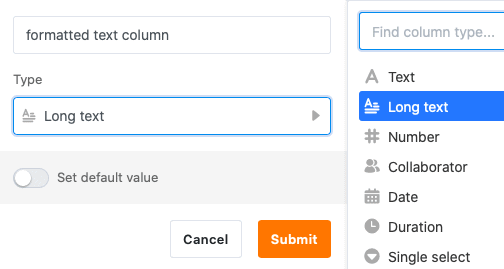
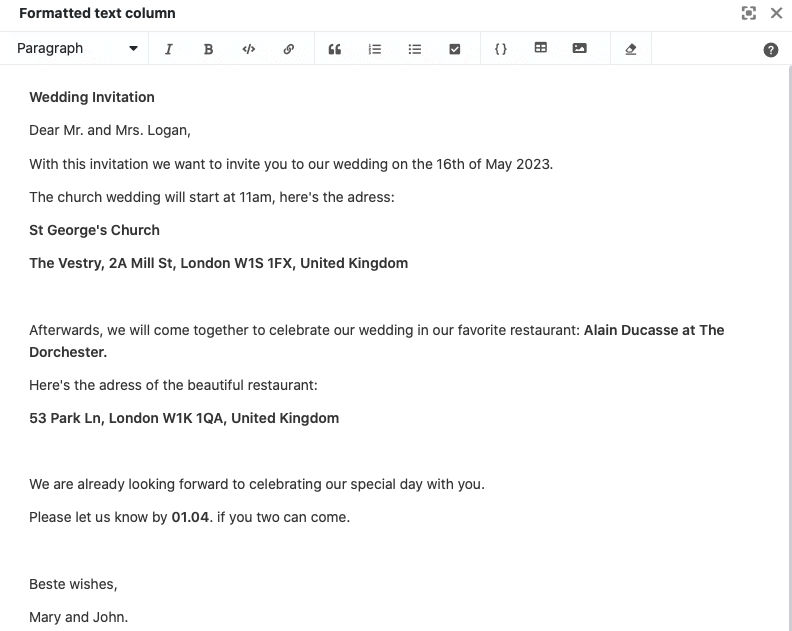

Für das Erfassen von **Zeichenfolgen** und **Texten** jeglicher Art stehen Ihnen in SeaTable zwei verschiedene Spaltentypen zur Verfügung: **Text** und **Formatierter Text**. Doch worin unterscheiden sich die zwei Spaltentypen genau? Und in welchen Fällen ist es sinnvoll, auf die formatierte Text-Spalte zurückzugreifen?

## Die Text-Spalte

Die Text-Spalte gehört zu den grundlegendsten **Spaltentypen** in SeaTable und wird Ihnen auch im Auswahl-Menü des Spaltentyps an erster Stelle angezeigt.

Zudem fügt SeaTable jeder neu erstellten Tabelle automatisch eine **Text-Spalte** als erste Spalte hinzu.

Die **erste Spalte** einer Tabelle weist mehrere [Besonderheiten]() auf, wie Sie im verlinkten Artikel nachlesen können.

### Verwendung der Text-Spalte

Die Text-Spalte eignet sich besonders gut zur Erhebung kurzer Einträge, beispielsweise **Begriffe**, **Namen**, **Wörter** oder anderer **Zeichenfolgen**, die keinen berechenbaren Zahlenwert haben, z. B. Adressen und Telefonnummern.

Bei der Verwendung der Spalte macht es Sinn, die Einträge **kurz** zu halten, da nur eine **begrenzte Anzahl an Zeichen** angezeigt werden kann, ohne dass die Spaltenbreite vergrößert werden muss.



Es gibt in SeaTable zwei weitere textbasierte Spaltentypen für spezielle Anwendungsfälle: die [E-Mail-Spalte](https://seatable.io/docs/text-und-zahlen/die-e-mail-spalte-und-ihre-verwendung/) und die [URL-Spalte](https://seatable.io/docs/text-und-zahlen/die-url-spalte/).

### Standardwert festlegen

Sie können für jede Text-Spalte einen voreingestellten [Standardwert]() festlegen. Dieser wird automatisch in jede neue Zeile der Tabelle eingetragen.

Wenn Sie als Standardwert die Referenz **{creator.name}** oder **{creator.id}** festlegen, wird automatisch der **Name** oder die **ID des Benutzers** eingetragen, der die Zeile hinzugefügt hat.

## Die Spalte Formatierter Text

Der Spaltentyp **Formatierter Text** gehört zu den spezifischeren Spaltentypen und wird Ihnen bei der Auswahl des Spaltentyps an zweiter Stelle angezeigt.

### Verwendung der Spalte Formatierter Text

Formatierte Text-Spalten eignen sich besonders zum Festhalten von **längeren Texten**, zum Beispiel Produktbeschreibungen, Checklisten oder Social Media Posts.

Sie verfassen Ihre Einträge dabei **nicht** direkt in der Zelle, sondern in einem per Klick aufrufbaren **Editor**, welcher verschiedene **Formatierungsoptionen** bietet. So können Sie im Gegensatz zur Text-Spalte auch längere Texte strukturieren.

Unter anderem können Sie ein **Absatzformat** wählen, die **Schrift** kursiv oder fett setzen sowie **Links**, **Zitate**, **Listen**, **Tabellen** und **Bilder** einfügen.


