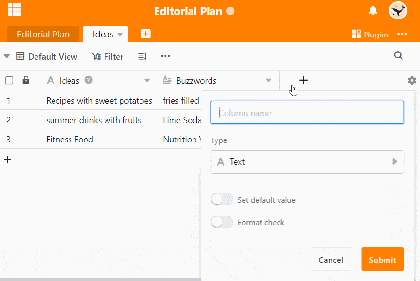

A coluna de correio electrónico é um tipo de coluna que lhe permite introduzir endereços de correio electrónico. Ao contrário de uma coluna de texto, a coluna de correio electrónico assegura que a entrada tem a estrutura de um endereço de correio electrónico válido.

Além disso, um pequeno envelope é exibido assim que se selecciona uma célula na coluna de correio electrónico. Um clique neste símbolo abre o seu programa de correio electrónico para que possa escrever directamente uma mensagem de correio electrónico para o endereço seleccionado.

## Usando a coluna de correio electrónico

1. Criar uma nova coluna com o tipo de coluna **E-mail** através do **símbolo de mais**.
2. Introduzir um **endereço de correio electrónico válido** numa célula da coluna.
3. Clique na célula que contém o endereço de correio electrónico e aparece um **envelope**.
4. Clique no ícone para abrir um **novo e-mail** no seu programa de e-mail padrão.


