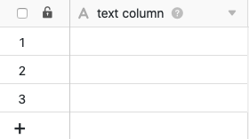
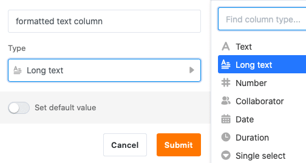

Deux types de colonnes sont disponibles dans SeaTable pour la saisie de **chaînes de caractères** et **de textes** de toute sorte : **Texte** et **Texte formaté**. Mais en quoi ces deux types de colonnes diffèrent-ils exactement ? Et dans quels cas est-il utile de recourir à la colonne Texte formaté ?

## La colonne de texte

La colonne de texte est l'un des **types de colonne** les plus basiques de SeaTable et est également affichée en premier dans le menu de sélection du type de colonne.

De plus, SeaTable ajoute automatiquement une **colonne de texte** comme première colonne à chaque nouveau tableau créé.

La **première colonne** d'un tableau présente plusieurs [particularités](https://seatable.io/fr/docs/arbeiten-mit-spalten/die-besonderheiten-der-ersten-spalte/), comme vous pouvez le lire dans l'article en lien.

### Utilisation de la colonne de texte

La colonne "texte" est particulièrement adaptée à la collecte d'entrées courtes, par exemple **des termes**, **des noms**, des **mots** ou d'autres **chaînes de caractères** qui n'ont pas de valeur numérique calculable, comme les adresses et les numéros de téléphone.

Lors de l'utilisation de la colonne, il est judicieux de garder les entrées **courtes**, car seul un **nombre limité de caractères** peut être affiché sans qu'il soit nécessaire d'augmenter la largeur de la colonne.



Il existe dans SeaTable deux autres types de colonnes basées sur le texte pour des applications spécifiques : la [colonne e-mail](https://seatable.io/fr/docs/text-und-zahlen/die-e-mail-spalte-und-ihre-verwendung/) et la [colonne URL](https://seatable.io/fr/docs/text-und-zahlen/die-url-spalte/).

### Définir la valeur par défaut

Vous pouvez définir une [valeur par défaut](https://seatable.io/fr/docs/arbeiten-mit-spalten/standardwert-fuer-eine-spalte-festlegen/) prédéfinie pour chaque colonne de texte. Celle-ci sera automatiquement insérée dans chaque nouvelle ligne du tableau.

Si vous définissez la référence **{creator.name}** ou **{creator.id}** comme valeur par défaut, le **nom** ou l'**ID de l'utilisateur** qui a ajouté la ligne sera automatiquement saisi.

## La colonne Texte formaté

Le type de colonne **Texte formaté** fait partie des types de colonne plus spécifiques et s'affiche en deuxième position lorsque vous sélectionnez le type de colonne.

### Utilisation de la colonne Texte formaté

Les colonnes de texte formatées sont particulièrement adaptées pour conserver **des textes plus longs**, par exemple des descriptions de produits, des listes de contrôle ou des posts de médias sociaux.

Vous ne rédigez **pas** vos entrées directement dans la cellule, mais dans un **éditeur** accessible en un clic, qui offre différentes **options de formatage**. Ainsi, contrairement à la colonne de texte, vous pouvez également structurer des textes plus longs.

Vous pouvez, entre autres, choisir un **format de paragraphe**, mettre la **police** en italique ou en gras et insérer **des liens**, des **citations**, des **listes**, des **tableaux** et **des images**.


