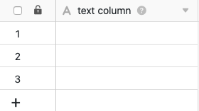

SeaTable fornece dois tipos diferentes de colunas para a introdução de **cordas** e **textos** de qualquer tipo: **Texto** e **Texto formatado**. Mas qual é exactamente a diferença entre os dois tipos de coluna? E em que casos é que faz sentido utilizar a coluna de texto formatado?

## A coluna de texto

A coluna de texto é um dos **tipos de coluna** mais básicos no SeaTable e é também apresentada em primeiro lugar no menu de seleção do tipo de coluna.

Além disso, SeaTable adiciona automaticamente uma **coluna de texto** como a primeira coluna a cada tabela criada recentemente.

A **primeira coluna de** uma tabela tem várias [características especiais](https://seatable.io/pt/docs/arbeiten-mit-spalten/die-besonderheiten-der-ersten-spalte/), como se pode ler no artigo ligado.

### Usando a Coluna de Texto

A coluna de texto é particularmente adequada para recolher entradas curtas, tais como **termos**, **nomes**, **palavras** ou outras **cadeias de caracteres** que não tenham um valor numérico calculável, por exemplo, endereços e números de telefone.

Ao utilizar a coluna, faz sentido manter as entradas **curtas**, uma vez que apenas um **número limitado de caracteres** pode ser exibido sem ter de aumentar a largura da coluna.



Existem dois outros tipos de colunas baseadas em texto no SeaTable para casos de uso especial: a [coluna de correio electrónico](https://seatable.io/pt/docs/text-und-zahlen/die-e-mail-spalte-und-ihre-verwendung/) e a [coluna URL](https://seatable.io/pt/docs/text-und-zahlen/die-url-spalte/).

### Definir valor por defeito

É possível definir um [valor](https://seatable.io/pt/docs/arbeiten-mit-spalten/standardwert-fuer-eine-spalte-festlegen/) predefinido para cada coluna de texto. Este valor é automaticamente introduzido em cada nova linha da tabela.

Se especificar a referência **{creator.name}** ou **{creator.id}** como valor predefinido, o **nome** ou **ID do utilizador** que adicionou a linha é automaticamente introduzido.

## A coluna Texto formatado

O tipo de coluna **Texto formatado** é um dos tipos de coluna mais específicos e é exibido em segundo lugar quando se selecciona o tipo de coluna.

### Utilização da coluna Texto formatado

As colunas de texto formatadas são particularmente adequadas para manter **textos mais longos**, por exemplo, descrições de produtos, listas de verificação ou mensagens nos meios de comunicação social.

**Não** escreva as suas entradas directamente na célula, mas num **editor** que pode ser chamado com um clique, que oferece várias **opções de formatação**. Em contraste com a coluna de texto, também pode estruturar textos mais longos.

Entre outras coisas, pode escolher um **formato de parágrafo**, definir a **fonte** para itálico ou negrito e inserir **links**, **citações**, **listas**, **tabelas** e **imagens**.


