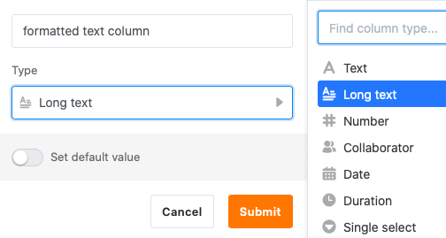

SeaTable предоставляет два различных типа колонок для ввода **строк** и **текстов** любого вида: **Текст** и **Форматированный текст**. Но в чем именно заключается разница между этими двумя типами столбцов? И в каких случаях имеет смысл использовать колонку форматированного текста?

## Текстовая колонка

Текстовый столбец является одним из самых основных **типов столбцов** в SeaTable и также отображается первым в меню выбора типа столбца.

Кроме того, SeaTable автоматически добавляет **текстовый столбец** в качестве первого столбца в каждую вновь создаваемую таблицу.

**Первый столбец** таблицы имеет несколько [особенностей](https://seatable.io/ru/docs/arbeiten-mit-spalten/die-besonderheiten-der-ersten-spalte/), как вы можете прочитать в статье по ссылке.

### Использование текстовой колонки

Текстовый столбец особенно удобен для сбора коротких записей, таких как **термины**, **названия**, **слова** или другие **символьные строки**, не имеющие вычисляемого числового значения, например, адреса и номера телефонов.

При использовании колонки имеет смысл делать записи **короткими**, так как без увеличения ширины колонки можно отобразить только **ограниченное количество символов**.



В SeaTable есть еще два текстовых типа столбцов для особых случаев использования: [столбец электронной почты](https://seatable.io/ru/docs/text-und-zahlen/die-e-mail-spalte-und-ihre-verwendung/) и [столбец URL](https://seatable.io/ru/docs/text-und-zahlen/die-url-spalte/).

### Установите значение по умолчанию

Для каждого текстового столбца можно задать значение по [умолчанию](https://seatable.io/ru/docs/arbeiten-mit-spalten/standardwert-fuer-eine-spalte-festlegen/). Оно автоматически вводится в каждую новую строку таблицы.

Если в качестве значения по умолчанию указать ссылку **{creator.name}** или **{creator.id}**, то автоматически вводится **имя** или **идентификатор пользователя**, добавившего строку.

## Колонка форматированного текста

Тип столбца **Форматированный текст** является одним из более специфических типов столбцов и отображается вторым при выборе типа столбца.

### Использование колонки Форматированный текст

Колонки форматированного текста особенно подходят для размещения **длинных текстов**, например, описаний товаров, контрольных списков или постов в социальных сетях.

Вы пишете свои записи **не** непосредственно в ячейке, а в **редакторе**, вызываемом одним щелчком мыши, который предлагает различные **варианты форматирования**. В отличие от текстовой колонки, вы можете структурировать и более длинные тексты.

Помимо прочего, вы можете выбрать **формат абзаца**, установить курсив или полужирный **шрифт**, а также вставить **ссылки**, **цитаты**, **списки**, **таблицы** и **изображения**.


