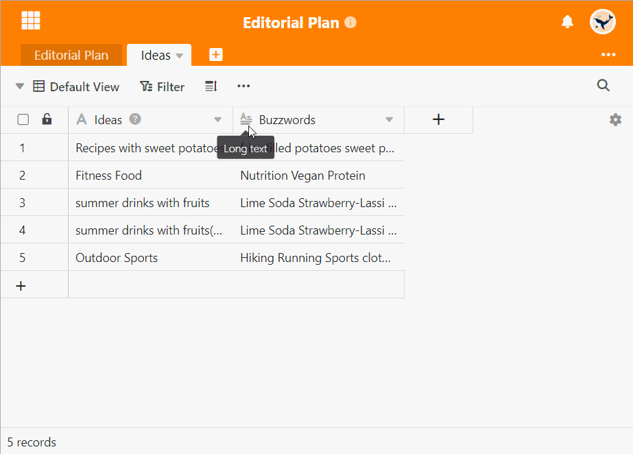

**URL-Spalten** interpretieren die eingegebene Information als eine Ressource im Internet oder im lokalen Netzwerk und erlauben Ihnen **Links** direkt per Klick aufzurufen. SeaTable ergänzt automatisch http(s):// als Präfix der URL, wenn Sie dieses nicht erfasst haben.

## So benutzen Sie die URL-Spalte

1. Legen Sie über das **Plus-Symbol** eine Spalte mit dem Spaltentyp **URL** an.
2. Fügen Sie eine **URL** in eine Zelle der Spalte ein. Sobald Sie die **Zelle** erneut auswählen, erscheint ein Link-Icon.
3. Klicken Sie auf das **Link-Icon**, um ein neues Fenster mit der gewünschten Internetseite zu öffnen.
   
