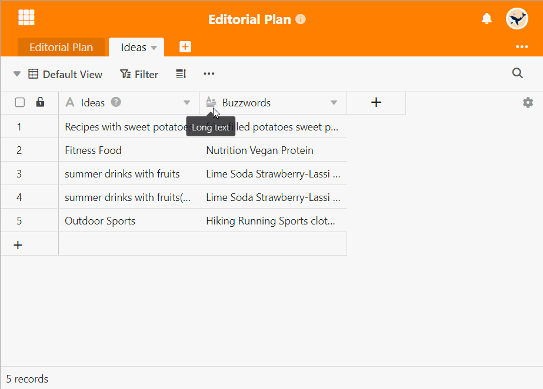

**Les colonnes URL** interprètent l'information saisie comme une ressource sur Internet ou sur le réseau local et vous permettent d'accéder directement **aux liens** en cliquant dessus. SeaTable ajoute automatiquement http(s):// comme préfixe de l'URL si vous ne l'avez pas saisi.

## Comment utiliser la colonne URL

1. Créez une colonne avec le type de colonne **URL** à l'aide du **symbole plus**.
2. Insérez une **URL** dans une cellule de la colonne. Dès que vous sélectionnez à nouveau la **cellule**, une icône de lien apparaît.
3. Cliquez sur l'**icône du lien** pour ouvrir une nouvelle fenêtre avec la page Internet souhaitée.


