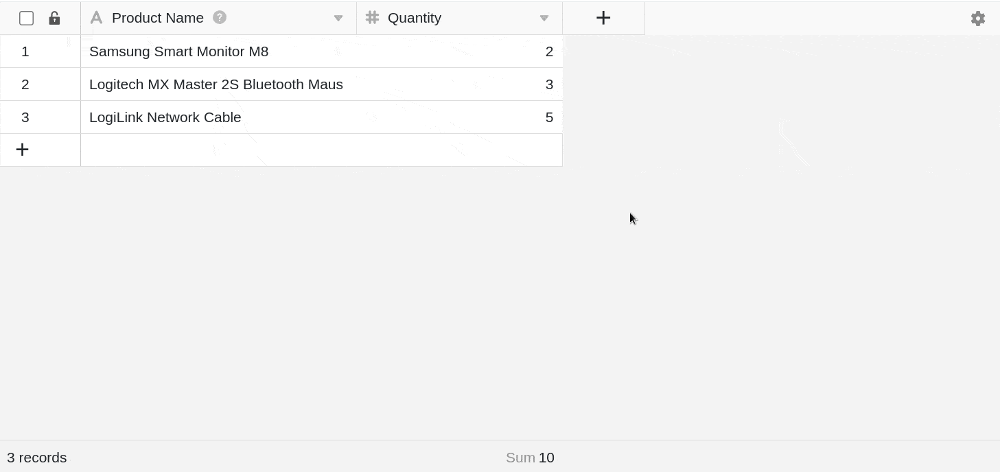

In SeaTable können Sie die **Zahlen-Spalte** vielseitig nutzen, um mit Zahlen jeder Art zu arbeiten (z. B. Anzahl von Gegenständen, Entfernung zu Zielen, Preis eines Produktes etc.).

## Anwendungsgebiet der Zahlen-Spalte

Die Verwendung von **Zahlen-Spalten** ermöglicht Ihnen beispielsweise die **Berechnung von Werten**, die Sie mit Formeln und [Statistiken](https://seatable.io/docs/seatable-nutzen/statistiken/) visualisieren können. Allerdings eignet sie sich nicht zum Speichern beliebig langer Zeichenfolgen (z. B. Kontonummern), da bei über 15 Ziffern gerundet wird. In diesem Fall sollten Sie die [Text-Spalte](https://seatable.io/docs/text-und-zahlen/die-spalten-text-und-formatierter-text/) verwenden.

Darüber hinaus bietet SeaTable andere Spalten an, die manchmal besser zu Ihren angegebenen Werten passen.

- Dauer und Zeiträume = [Dauer-Spalte](https://seatable.io/docs/datum-dauer-und-personen/die-dauer-spalte/)
- Datum und Zeitpunkte = [Datum-Spalte](https://seatable.io/docs/datum-dauer-und-personen/die-datum-spalte/)
- Geo-Informationen = [Geopositions-Spalte](https://seatable.io/docs/andere-spalten/die-geopositions-spalte/)

## Hinzufügen einer Zahlen-Spalte

1. Klicken Sie auf das **Plus-Symbol** rechts neben der letzten Spalte.
2. Geben Sie der Spalte einen **Namen**.
3. Wählen Sie als Spaltentyp **Zahl** aus.
4. Entscheiden Sie sich für ein **Format** (z. B. Zahl, Prozent oder Währung).
5. Mit einem Klick auf **Weitere Einstellungen** können Sie zudem noch Details einstellen.
6. Fügen Sie die Spalte mit **Abschicken** hinzu.

## Formateinstellungen

Das **Zahlenformat** können Sie auch im Nachhinein bearbeiten und feinjustieren. Öffnen Sie hierzu zunächst das Drop-down-Menü mit den **Spalten-Optionen** über das Dreieck \[icon c="grey"\]dtable-icon-drop-down\[/icon\] im Spaltenkopf und klicken Sie im Anschluss auf \[icon c="grey"\]dtable-icon-set-up\[/icon\] **Formateinstellungen**.

Sie können nun ein anderes **Format** auswählen, **Dezimal-** und **Tausendertrennzeichen** einstellen sowie die Anzahl der **Nachkommastellen** ändern.

### Verfügbare Formate der Zahlen-Spalte

Folgende Zahlenformate stehen Ihnen zur Verfügung:

- **Zahl**
Verwendung einer einfachen Zahl, beispielsweise für die Anzahl von Gegenständen.- **Prozent**
Verwendung von Prozentangaben, beispielsweise für den Fortschritt in der Bearbeitung von Aufgaben.- **Währungen (Yuan, Dollar & Euro)**
Verwendung von verschiedenen Währungen, beispielsweise für die Preise von Produkten.- **Benutzerdefinierte Währung**
Verwendung einer benutzerdefinierten Währung, bei der das Währungssymbol individuell eingegeben werden kann.

## Standardwert festlegen und Eingabe validieren

Sie können für jede Zahlen-Spalte einen [Standardwert festlegen](https://seatable.io/docs/arbeiten-mit-spalten/standardwert-fuer-eine-spalte-festlegen/), der automatisch in jede Zeile eingetragen wird, die Sie Ihrer Tabelle neu hinzufügen.

Um **Fehler** und **Extremwerte** direkt zu identifizieren, können Sie zudem die **Eingabe validieren**. Dazu definieren Sie einen **Zahlenbereich**, in dem die Werte der Spalte liegen sollten; Zellen mit einem höheren oder niedrigeren Wert werden dann farblich hervorgehoben.

Sie können diese Einstellungen beim Anlegen der Zahlen-Spalte oder im Nachhinein vornehmen:

1. Öffnen Sie das Drop-down-Menü mit den **Spalten-Optionen** über das Dreieck \[icon c="grey"\]dtable-icon-drop-down\[/icon\] im Spaltenkopf.
2. Klicken Sie im Anschluss auf **Spaltentyp anpassen**.
3. Klicken Sie auf **Weitere Einstellungen** und aktivieren Sie ganz unten die entsprechenden **Regler**.

