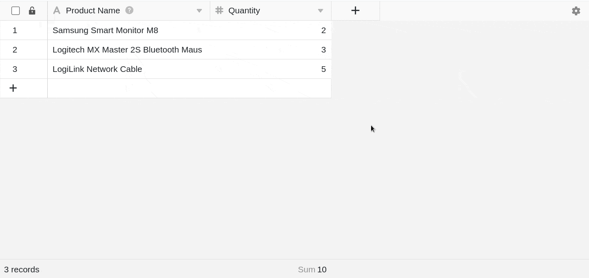
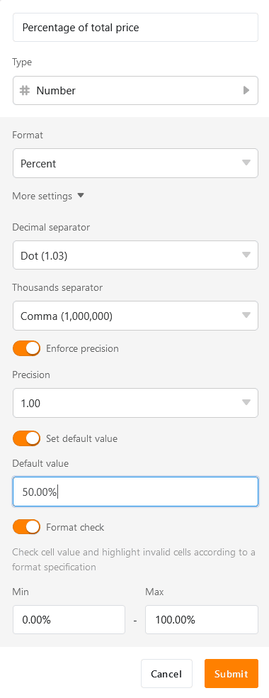

В SeaTable вы можете использовать **колонку чисел** различными способами для работы с числами любого вида (например, количество товаров, расстояние до пунктов назначения, цена продукта и т.д.).

## Область применения числовой колонки

Использование **числовых столбцов** позволяет, например, **вычислять значения**, которые можно визуализировать с помощью формул и [статистики](https://seatable.io/ru/docs/seatable-nutzen/statistiken/). Однако он не подходит для сохранения строк произвольной длины (например, номеров счетов), так как при использовании более 15 цифр происходит округление. В этом случае следует использовать [текстовый столбец](https://seatable.io/ru/docs/text-und-zahlen/die-spalten-text-und-formatierter-text/).

Кроме того, SeaTable предлагает другие колонки, которые иногда лучше подходят к заданным вами значениям.

- Продолжительность и периоды = [колонка](https://seatable.io/ru/docs/datum-dauer-und-personen/die-dauer-spalte/) продолжительности
- Дата и время = [колонка даты](https://seatable.io/ru/docs/datum-dauer-und-personen/die-datum-spalte/)
- Геоинформация = [колонка геопозиции](https://seatable.io/ru/docs/andere-spalten/die-geopositions-spalte/)

## Добавление числового столбца

1. Нажмите на **символ плюса** справа от последнего столбца.
2. Дайте колонке **имя**.
3. Выберите **Число** в качестве типа столбца.
4. Определите **формат** (например, число, процент или валюта).
5. Вы также можете задать подробности, нажав на **Дополнительные настройки**.
6. Добавьте колонку с помощью **Submit**.

## Настройки формата

**Формат номера** можно также редактировать и настраивать впоследствии. Для этого сначала откройте выпадающее меню с **параметрами столбца** с помощью треугольника  в заголовке столбца, а затем нажмите на  **Настройки формата**.

Теперь вы можете выбрать другой **формат**, установить **десятичные** и **тысячные разделители** и изменить количество **десятичных знаков**.

### Доступные форматы столбца чисел

Доступны следующие форматы номеров:

- **Номер**

Использование простого числа, например, для обозначения количества предметов.

- **Процент**

Использование процентов, например, для оценки прогресса в выполнении заданий.

- **Валюты (юань, доллар и евро)**

Использование различных валют, например, для цен на продукты.

- **Пользовательская валюта**

Использование пользовательской валюты, где символ валюты может быть введен индивидуально.

## Установка значения по умолчанию и проверка ввода

Для каждого числового столбца можно [задать значение по умолчанию](https://seatable.io/ru/docs/arbeiten-mit-spalten/standardwert-fuer-eine-spalte-festlegen/), которое будет автоматически вводиться в каждую строку, добавляемую в таблицу.

Для непосредственного выявления **ошибок** и **экстремальных значений** можно также **провести валидацию вводимых** данных. Для этого задайте **числовой диапазон**, в котором должны находиться значения столбца; ячейки с большим или меньшим значением будут выделены цветом.

Эти настройки можно выполнить как при создании числового столбца, так и после:

1. Открыть выпадающее меню с **параметрами столбца** можно с помощью треугольника  в заголовке столбца.
2. Затем нажмите кнопку **Настроить тип столбца**.
3. Нажмите кнопку **Дополнительные настройки** и активируйте соответствующие **ползунки** внизу.

