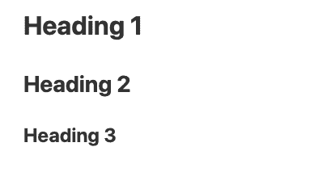
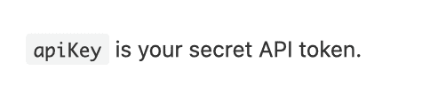

[Markdown](https://en.wikipedia.org/wiki/Markdown) ist eine stark vereinfachte Auszeichnungssprache, die zur **Formatierung von Texten** verwendet wird. SeaTable nutzt Markdown an verschiedenen Stellen, um längere Texte optisch ansprechend zu formatieren.

Sie müssen sich nicht zwingend mit der Syntax von Markdown vertraut machen. Doch unabhängig davon, ob Sie Markdown zum ersten Mal verwenden oder bereits Erfahrung damit haben, wird dieser Artikel Ihnen helfen besser zu verstehen, wo und wie Sie die SeaTable Version von Markdown einsetzen können.

## SeaTable Markdown

Derzeit gibt es fünf Bereiche, in denen Sie die Markdown-Syntax in SeaTable einsetzen können. Diese sind:

- Spalten des Typs [Formatierter Text](https://seatable.io/docs/text-und-zahlen/die-spalten-text-und-formatierter-text/)
- [Base-Beschreibungen](https://seatable.io/docs/arbeiten-mit-bases/wie-man-einer-base-eine-beschreibung-hinzufuegt/)
- E-Mail-Texte beim Versand über [Automationen](https://seatable.io/docs/beispiel-automationen/e-mail-versand-per-automation/) und [Schaltflächen](https://seatable.io/docs/andere-spalten/eine-e-mail-per-schaltflaeche-verschicken/)
- [Webformulare](https://seatable.io/docs/webformulare/webformulare/)
- [Universelle Apps](https://seatable.io/docs/apps/universelle-app/)

Sobald Markdown in SeaTable zum Einsatz kommt, wird Ihnen die folgende Eingabemaske angeboten. Selbstverständlich können Sie wie gewohnt Wörter oder Textblöcke markieren und dann die gewünschte Formatierung auswählen.


Alternativ können Sie aber auch unmittelbar durch die Eingabe von gewissen Sonderzeichen die Markdown-Formatierung auslösen. Tippen Sie doch einfach mal in einem Markdown-Eingabefeld eine  gefolgt von einem Wort ein. Sie werden sehen, dass die Raute in der Markdown-Syntax für eine erste Überschrift steht. Wenn Sie also wissen, welches Sonderzeichen welche Formatierung auslöst, können Sie deutlich schneller Ihre Texte erfassen und formatieren.

Aktuell können Sie nur einen Teil der Formatierung durch ein Sonderzeichen auslösen. Welche dies sind, erfahren Sie in diesem Artikel.



## Syntax-Formatierungen in SeaTable per Sonderzeichen auslösen

Derzeit können Sie in SeaTable die folgenden Syntax-Optionen per Sonderzeichen aktivieren.

### Überschriften

Eine Zeile, die mit einem bis drei -Zeichen beginnt, gefolgt von einem Leerzeichen, ergibt eine **Überschrift** der ersten bis dritten Ebene.

**Markdown-Syntax**

\# First level header ## Second level header ### Third level header

**Ergebnis**



### Fett und kursiv

Text, der von einem  oder  Paar umgeben ist, wird **kursiv** formatiert (was in Markdown eine Betonung bedeutet); Text, der von einem doppelten  oder  Paar umgeben ist, wird **fett** formatiert (was in Markdown eine starke Betonung bedeutet). Die Formatierungen können auch mit anderen Inline-Formaten kombiniert werden.

**Markdown-Syntax**

\*This text will be italic\* \_This will also be italic\_

\*\*This text will be bold\*\* \_\_This will also be bold\_\_

\_\*\*Combine them for bold italic\*\*\_

**Ergebnis**

_This text will be italic_ _This will also be italic_

**This text will be bold** **This will also be bold**

_**Combine them for bold italic**_

### Unsortierte Liste

Sie können entweder  oder  als Markierung für eine **unsortierte Liste** verwenden.


### Sortierte Liste

Beginnt eine Zeile mit einer , wird sie automatisch in eine **sortierte Liste** umgewandelt.

1\. Item 1 2. Item 2

### Blockzitate

Ein **Blockzitat** ist eine Zeile, die mit  beginnt und auf die dann der Inhalt des Zitats folgt. Zitate sind durch eine Einrückung und einen Rahmen am linken Rand gekennzeichnet.


### Inline-Code

Text, der von einem Paar  umgeben ist, wird als Inline-Code dargestellt. So wird aus **apiKey is your secret API token** die folgende Formatierung:



### Code-Blöcke

Ein **Code-Block** wird durch drei aufeinanderfolgende **Backticks**  eingeleitet. Das Besondere am Code-Block ist, dass der Inhalt als **Inline-Code** mit Monospace-Schrift dargestellt wird. Auch Einrückungen werden genauso beibehalten, wie Sie eingegeben werden.


### Zeilenumbrüche

Jeder Zeilenumbruch  wird wie ein harter Zeilenumbruch mit Abstand zwischen den beiden Zeilen behandelt. Ein Zeilenumbruch ohne Abstand zwischen den einzelnen Zeilen ist nicht möglich. Auch **mehrere Zeilenumbrüche** hintereinander werden entfernt und auf einen einfachen Zeilenumbruch reduziert.

## Formatierungen, die Sie nicht durch Sonderzeichen aktivieren können

**Checkboxen** werden typischerweise in Markdown durch ein  oder ein  erfasst. Diese Eingabe wird jedoch nicht automatisch in eine Checkbox umgewandelt. Stattdessen müssen Sie das kleine Checkbox-Icon  anklicken.

Auch **Hyperlinks** werden in SeaTable Markdown unterstützt, können aber nur über das Icon  eingefügt werden.

## Nicht unterstützte Formatierungen

 wird von SeaTable nicht unterstützt. Auch doppelte Zeilenumbrüche werden entfernt und ein  wird nicht als zusätzlicher Zeilenumbruch interpretiert.
