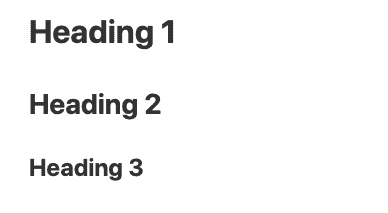

[Markdown](https://en.wikipedia.org/wiki/Markdown) is a highly simplified markup language used to **format text**. SeaTable uses Markdown in various places to format longer texts in a visually appealing way.

You don't necessarily need to be familiar with the syntax of Markdown. But whether you are using Markdown for the first time or already have experience with it, this article will help you better understand where and how to use the SeaTable version of Markdown.

## SeaTable Markdown

Currently, there are five areas where you can use Markdown syntax in SeaTable. These are:

- Columns of the [Formatted Text](https://seatable.io/en/docs/text-und-zahlen/die-spalten-text-und-formatierter-text/) type
- [Base descriptions](https://seatable.io/en/docs/arbeiten-mit-bases/wie-man-einer-base-eine-beschreibung-hinzufuegt/)
- Email texts when sending via [automations](https://seatable.io/en/docs/beispiel-automationen/e-mail-versand-per-automation/) and [buttons](https://seatable.io/en/docs/andere-spalten/eine-e-mail-per-schaltflaeche-verschicken/)
- [Forms](https://seatable.io/en/docs/webformulare/webformulare/)
- [Universal apps](https://seatable.io/en/docs/apps/universelle-app/)

As soon as Markdown is used in SeaTable, you will be offered the following input mask. Of course, you can select words or text blocks as usual and then choose the desired formatting.


Alternatively, you can trigger Markdown formatting directly by typing certain special characters. Just type in a Markdown input field a  followed by a word. You will see that in Markdown syntax the hash stands for a first heading. So if you know which special character triggers which formatting, you can capture and format your texts much faster.

Currently, you can only trigger some of the formatting with a special character. You can find out what these are in this article.



## Trigger syntax formatting in SeaTable via special characters

Currently you can enable the following syntax options in SeaTable by special character.

### Headings

A row, which can be used with one to three \-character, followed by a space, results in a **Headline** the first to the third level.

**Markdown syntax**

\## First level header  
\## Second level header  
\### Third level header

**Result**



### Bold and italic

Text created by a  or  Couple is surrounded **italic** formatted (which in Markdown means an emphasis); text that is accompanied by a double  or  Couple is surrounded **bold** formatted (which means heavy emphasis in Markdown). The formatting can also be combined with other inline formats.

**Markdown syntax**

\*This text will be italic\*  
This will also be italic

\*\*This text will be bold\*\*  
\_\_This will also be bold\_\_

\_\*\*Combine them for bold italic\*\*\_

**Result**

_This text will be italic_  
_This will also be italic_

**This text will be bold**  
**This will also be bold**

_**Combine them for bold italic**_

### Unsorted list

You can either  or  as a marker for a **unordered list** use


### Sorted list

If a row begins with a , it is automatically converted into a **sorted list** converted.

1\. item 1  
2\. item 2

### Block Quotes

A **Blockquote** is a row, which is linked to  and then followed by the content of the quotation. Quotations are indicated by an indentation and a frame in the left margin.


### Inline code

Text created by a  pair is surrounded is represented as inline code. Thus from **apiKey is your secret API token** the following formatting:


### Code blocks

A **Code block** is determined by three successive **Backticks**  introduced. The special feature of the code block is that the content is displayed as a **Inline code** is displayed with monospace font. Indentations are also retained exactly as they are entered.


### Line breaks

Any line break  is treated like a hard line break with space between the two rows . A line break without spacing between the individual rows is not possible. Also **multiple line breaks** are removed and reduced to a simple line break.

## Formatting that you cannot activate with special characters

**Checkboxes** are typically represented in Markdown by a  or a  is entered. However, this input is not automatically converted into a checkbox. Instead, you must click the small checkbox icon  click.

**Hyperlinks** are also supported in SeaTable Markdown, but can only be inserted via the  icon.

## Unsupported formatting

 is not supported by SeaTable. Also double line breaks are removed and a  is not interpreted as an additional line break.
