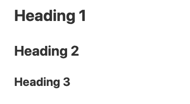

[Markdown](https://en.wikipedia.org/wiki/Markdown) - это сильно упрощенный язык разметки, используемый для **форматирования текста**. SeaTable использует Markdown в различных местах для форматирования длинных текстов в визуально привлекательном виде.

Вам не обязательно быть знакомым с синтаксисом Markdown. Но независимо от того, используете ли вы Markdown впервые или уже имеете опыт работы с ним, эта статья поможет вам лучше понять, где и как использовать версию Markdown для SeaTable.

## SeaTable Markdown

В настоящее время существует пять областей, где вы можете использовать синтаксис Markdown в SeaTable. К ним относятся:

- Колонки типа [форматированного текста](https://seatable.io/ru/docs/text-und-zahlen/die-spalten-text-und-formatierter-text/)
- [Базовые описания](https://seatable.io/ru/docs/arbeiten-mit-bases/wie-man-einer-base-eine-beschreibung-hinzufuegt/)
- Тексты электронной почты при отправке через [автоматизацию](https://seatable.io/ru/docs/beispiel-automationen/e-mail-versand-per-automation/) и [кнопки](https://seatable.io/ru/docs/andere-spalten/eine-e-mail-per-schaltflaeche-verschicken/)
- [Веб-формы](https://seatable.io/ru/docs/webformulare/webformulare/)
- [Универсальные приложения](https://seatable.io/ru/docs/apps/universelle-app/)

Как только Markdown будет использован в SeaTable, вам будет предложена следующая маска ввода. Конечно, вы можете пометить слова или текстовые блоки как обычно, а затем выбрать нужное форматирование.


Кроме того, форматирование Markdown можно вызвать непосредственно вводом определенных специальных символов. Просто введите специальный символ в поле ввода Markdown.  за которым следует слово. Вы увидите, что хэш в синтаксисе Markdown обозначает первый заголовок. Таким образом, если вы знаете, какой специальный символ вызывает то или иное форматирование, вы сможете захватывать и форматировать свои тексты гораздо быстрее.

В настоящее время можно вызвать только часть форматирования с помощью специального символа. Вы можете узнать, что это такое, в этой статье.



## Запуск форматирования синтаксиса в SeaTable с помощью специальных символов

В настоящее время в SeaTable можно активировать следующие опции синтаксиса с помощью специальных символов.

### Заголовки

Строка, начинающаяся с цифр от одного до трех \-символ, за которым следует символ пробела, приводит к результату **Заголовок** с первого по третий уровень.

**Синтаксис разметки**

\## Заголовок первого уровня  
\## Заголовок второго уровня  
\## Заголовок третьего уровня

**Результат**



### Полужирный и курсив

Текст, написанный  или  Пара окружена **курсив** форматированный (что в Markdown означает подчеркивание); текст, который сопровождается двойным  или  Пара окружена **полужирный** форматированный (что означает сильное подчеркивание в Markdown). Форматирование также можно комбинировать с другими встроенными форматами.

**Синтаксис разметки**

\*Этот текст будет набран курсивом\*.  
Это также будет курсив

\*\*Этот текст будет выделен жирным шрифтом\*\*.  
\_\_Это также будет выделено жирным шрифтом\_\_

\_\*\*Сочетайте их для получения полужирного курсива\*\*\_.

**Результат**

_Этот текст будет набран курсивом_  
_Это также будет курсив_

**Этот текст будет выделен жирным шрифтом**  
**Этот текст также будет жирным**

_**Объедините их для получения полужирного курсива**_

### Несортированный список

Вы можете либо  или  как маркер для **неупорядоченный список** использовать.


### Сортированный список

Если строка начинается с символа он автоматически преобразуется в **отсортированный список** преобразованный.

Пункт 1  
2\. пункт 2

### Котировки блоков

A **Блоквот** это строка, которая начинается с  а затем следует содержание цитаты. Цитаты отмечаются отступом и рамкой на левом поле.


### Инлайн-код

Текст, написанный  пара окружена, представляется как встроенный код. Таким образом, из **apiKey - это ваш секретный токен API** следующее форматирование:


### Кодовые блоки

A **Кодовый блок** достигается тремя последовательными **Backticks**  введен. Особенностью блока кода является то, что содержание **Инлайн-код** отображается моноширинным шрифтом. Отступы также сохраняются точно в том виде, в котором они были введены.


### Разрывы строк

Каждый разрыв строки  рассматривается как жесткий перенос строки с интервалом между двумя строками. Разрыв строки без интервала между отдельными строками невозможен. Также **множественные переносы строк** удаляются и сводятся к простому переносу строки.

## Форматирование, которое нельзя активировать с помощью специальных символов

**Флажки** обычно представлены в Markdown с помощью  или  вводится. Однако этот ввод не преобразуется автоматически в флажок. Вместо этого необходимо нажать на маленький значок флажка  нажать.

**Гиперссылки** также поддерживаются в SeaTable Markdown, но их можно вставлять только с помощью значка .

## Форматирование не поддерживается

 не поддерживается SeaTable. Дублирующиеся переносы строк также удаляются, и в таблице появляется надпись  не интерпретируется как дополнительный перевод строки.
