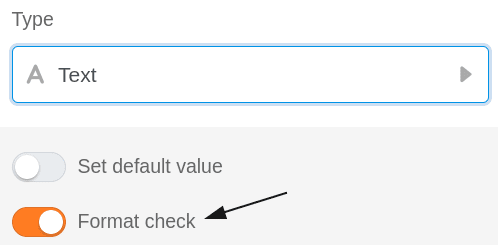

When using text columns in your tables, you have the option to validate inputs. Using validation that supports regular expressions, you can validate cell values and highlight cells with content that deviates from the valid format.



## Validate inputs

1. If you want to validate the entries in an already created text column, first click on the **triangle icon**  of the corresponding column.
2. Select **Customize Column Type** from the drop-down menu.
3. Activate the **Validate input** slider
4. Define a **target format**.
5. Confirm with **Submit**.

## Consequence of validation

After successful validation, the **cells** with **content different** from the target format will be highlighted in red.

## Regular expressions

SeaTable supports **regular expressions** for validating your entries in text columns.  
You can find some examples in the following table:

| Regular expression              | Function                                                                 |
| ------------------------------- | ------------------------------------------------------------------------ |
| \[123456\]                      | Check whether an input corresponds to a school grade from 1 to 6.        |
| \[1-9\]\[0-9\]?\[0-9\]?\[a-z\]? | Check format of a German house number (3 digits + 1 letter)              |
| \[0-9\]{5}                      | Checking the format of German postal codes (5x a number between 0 and 9) |
| \[0-9/. \\-\]+                  | Checking the format of a phone number                                    |
| Max.\*Mustermann                | Search for a possible middle name of an author                           |


