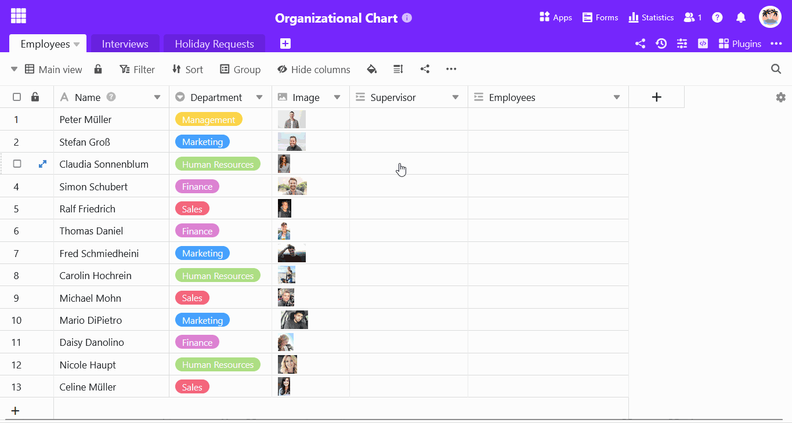

С помощью **столбца ссылок** в SeaTable можно не только [связать несколько таблиц](https://seatable.io/ru/docs/verknuepfungen/wie-man-tabellen-in-seatable-miteinander-verknuepft/), но и **соотнести записи данных в одной и той же таблице**.

Это особенно полезно, если данные в вашей таблице имеют **иерархию**.

## Добавьте ссылку в таблицу

1. Нажмите на **символ плюса** справа от заголовка последнего столбца.
2. Введите **имя родительского столбца** в поле ввода.
3. В качестве типа столбца выберите **Ссылка на другие записи**.
4. Выберите **текущую таблицу** в качестве таблицы для связи.
5. Подтвердите с помощью кнопки **Отправить**.
6. SeaTable автоматически добавляет **второй столбец для подчиненных записей**.



## Связывание записей данных в таблице

1. Щелкните по **ячейке в столбце ссылок**, а затем по появившемуся **символу плюса**.
2. Теперь **в таблице** перечислены доступные **строки**. Щелкните строку (строки), которую нужно связать с выбранной строкой.
3. **Связанная запись** сразу же отображается в обоих столбцах ссылок.



## Почему для одной и той же ссылки есть два столбца?

Если вы создаете колонку ссылок, которая связывает записи в одной и той же таблице, SeaTable автоматически создает вторую колонку ссылок.

- В **первом** столбце ссылок вы можете увидеть записи данных, которые являются **главными для** строки.
- Во **втором** столбце ссылок вы можете увидеть записи данных, которые **подчиняются** строке.

Поэтому **родители и дети** в отношениях "родитель-ребенок" записываются и отображаются в отдельных столбцах. Таким образом, SeaTable гарантирует, что для каждого отношения есть родительская и дочерняя запись данных.



## Похожие статьи

- Если вы хотите наглядно **представить** иерархические связи, мы можем порекомендовать вам [плагин организационной диаграммы](https://seatable.io/ru/docs/plugins/anleitung-zum-organigramm-plugin/).
- По всем остальным вопросам работы с колонками ссылок обращайтесь к статье [Как связать таблицы в SeaTable](https://seatable.io/ru/docs/verknuepfungen/wie-man-tabellen-in-seatable-miteinander-verknuepft/).
