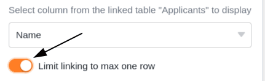

SeaTable позволяет связывать информацию из разных таблиц. Для этого используйте тип столбца **Ссылка на другие записи**.

## Чтобы связать две таблицы вместе

1. Создайте новый столбец и выберите тип столбца **Ссылка на другие записи**.
2. Дайте колонке **имя**.
3. В разделе **Выбрать таблицу для связывания** выберите таблицу, записи которой вы хотите связать с текущей таблицей.
4. Нажмите **Отправить**.
5. Содержимое нового столбца все еще пусто. Чтобы заполнить его, можно **связать существующие записи** или **добавить новые строки**.

Как только таблицы будут связаны, вы можете вызвать информацию о связанных записях через **диалог ссылок**. Для этого нажмите на **символ двойной стрелки** в **ячейке** столбца ссылок или **дважды щелкните мышь**ю. **Связанные записи** перечислены в открывшемся диалоге ссылок. Щелкните на записи, чтобы просмотреть **информацию о строке** в дополнительном окне.

## Связать существующие записи

1. Щелкните в **ячейке** **столбца ссылок**, а затем нажмите на появившийся **символ плюса**.
2. Теперь перечислены доступные **строки связанной таблицы**. Выберите строку (строки), которую нужно связать со строкой текущей таблицы.
3. В колонке ссылок каждая строка сразу отображается **как связанная запись**.



Используя **встроенную функцию поиска** в диалоге ссылок, можно перебирать записи связанной таблицы, чтобы быстро найти нужную строку.



## Добавить новый ряд

Вы можете даже добавить **новую строку** в **связанную таблицу** через диалог ссылок, не переключаясь на эту таблицу. Строка добавляется в связанную таблицу среди существующих записей и отображается как связанная запись в колонке ссылок открытой таблицы.

1. **Дважды щелкните** по **ячейке** **столбца ссылок** или нажмите на синий **символ двойной стрелки**, чтобы открыть диалог ссылок.

3. Нажмите кнопку **Добавить строку**.

5. В открывшемся окне заполните различные **столбцы таблицы**.

7. Нажмите кнопку **Отправить**, чтобы создать новую строку.

9. **Новая строка** автоматически добавляется в **связанную таблицу** и отображается в текущей открытой таблице как **связанная запись** в столбце ссылки.

## Редактирование существующих записей связанной таблицы

1. Щелкните мышью в **ячейке** столбца ссылок.
2. Щелкните на **связанной записи**, которую необходимо отредактировать.
3. Откроются **реквизиты строки**. Внесите в них необходимые **изменения**.
4. **Закройте** окно для **сохранения** изменений.

## Удалить ссылки

Удалить записи, связанные в колонке ссылок, можно всего несколькими щелчками мыши. Для этого достаточно открыть **диалог** ссылок соответствующего столбца ссылок и щелкнуть на **символе X** справа от нужной записи.



## Настройки колонки ссылок

Колонка ссылок позволяет очень легко создавать и изменять различные настройки. Для этого нажмите на треугольный **раскрывающийся символ** колонки ссылок в заголовке таблицы, а затем на **Настройки**.

### Выбор связанного столбца из связанной таблицы

В выпадающем меню можно сначала выбрать **столбец связанной таблицы**, **записи** которого будут отображаться в столбце ссылок.

### Ограничение ссылок одной строкой

Активизировав соответствующий ползунок, можно ограничить связывание **не более чем одной строкой**. Если эта настройка активна, то в каждую ячейку столбца ссылок может быть добавлена только **одна связанная запись**.

Если в ячейку уже добавлена связанная запись, опции добавления дополнительных записей больше **не** отображаются.

Эта настройка может быть полезна, например, если счет-фактура должен быть связан с соответствующим заказом из другой таблицы - т.е. если связанные записи данных образуют логические **пары**. В этом случае добавление дополнительных связей может привести к путанице и негативно сказаться на рабочих процессах.

### Ограничение ссылок для одного вида

Активизировав эту настройку, можно ограничить ссылки **одним представлением** связанной таблицы. Для этого задается ранее определенное **представление** связанной таблицы. После этого в колонке ссылок можно связывать **только** записи этого представления. Связывание записей из других представлений при этом становится **невозможным**.

Эта настройка особенно полезна в [фильтруемых представлениях](https://seatable.io/ru/docs/ansichtsoptionen/filtern-von-eintraegen-in-einer-ansicht/) для ограничения выбора записей, которые могут быть связаны. В сочетании с [ограничением связи одной строкой](https://seatable.io/ru/docs/verknuepfungen/wie-man-tabellen-in-seatable-miteinander-verknuepft/#7-toc-title) эта настройка может быть полезна, если требуется связать **отдельные записи** в таблицах.

### Предотвращение связывания существующих записей

В настройках колонки ссылок можно также запретить связывание существующих записей, активировав соответствующий ползунок. Если ползунок **активирован**, то соответствующий столбец ссылок поддерживает **только** добавление **новых строк** или записей.

После этого существующие записи в связанной таблице больше **не** могут быть связаны в столбце. Однако на записи, которые уже были связаны в столбце, эта настройка **не влияет**.

## Параметры просмотра диалога ссылок

В диалоге ссылок колонки ссылок также доступны различные варианты просмотра.

### Настройте размер окна

Чтобы все связанные записи были видны сразу, можно изменить **размер** диалогового окна ссылок. Для этого достаточно навести курсор мыши на один из внешних краев, пока курсор не превратится в **двойную стрелку**, и, удерживая кнопку мыши, перетащить край в нужном направлении.

### Настройте ширину столбца

Чтобы вместить в окно больше записей столбцов связанных строк, вы также можете настроить **ширину** отображаемых **столбцов** в диалоге ссылок. Для этого наведите курсор мыши на **область между двумя названиями столбцов**, пока курсор не превратится в **двойную стрелку**, и, удерживая кнопку мыши, перетащите невидимую пограничную линию влево или вправо, пока не достигнете нужной **ширины столбцов**.

### Скрыть колонки

Чтобы сделать диалог ссылок еще более понятным, вы можете скрыть любое количество колонок связанных записей, нажав на **символ глаза**. Откроется окно, в котором вы можете **(де)активировать** отдельные колонки с помощью ползунков. Соответственно, колонки скрываются или отображаются в обзоре связанных записей.

### Сортировка записей

Нажмите на **символы стрелок, чтобы** **отсортировать** связанные записи в диалоге ссылок. Используйте эту функцию, например, для отображения связанных записей в алфавитном порядке на основе текстовой колонки или для сортировки по другой колонке.



## Часто задаваемые вопросы



Я не могу найти этот тип столбца. Можно ли не создавать ссылку?|||

Колонка Link доступна в каждой подписке SeaTable. Однако вы, вероятно, пытаетесь изменить тип колонки существующей колонки. Когда вы [изменяете](https://seatable.io/ru/docs/arbeiten-mit-spalten/wie-man-den-spaltentyp-anpasst/) тип колонки, тип колонки "Ссылка на **другие записи** " вам фактически _недоступен_. Вместо этого создайте **новую колонку**, и вам будет предложен нужный тип колонки.


