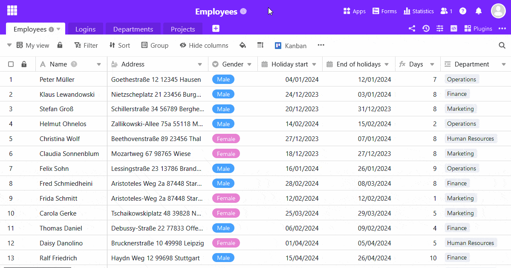

Un formulario **web** convierte su tabla en un formulario con campos abiertos. Una columna de la tabla corresponde a un campo del formulario web asociado.

El **formulario web clásico** es ideal para encuestas en línea y recopilación estructurada de nuevos datos, ya que puede guiar a los usuarios a través del proceso de cumplimentación.

Para el acceso, cree un **enlace** que permita a los usuarios **sin cuenta de usuario SeaTable** introducir datos en el formulario web.

Puede leer más sobre [formularios web]() en el artículo enlazado.

## Para crear un formulario web

1. Abra la gestión de formularios a través del botón  **web forms** situado en la parte superior derecha de la cabecera base.
2. Seleccione **Crear formulario web** en la nueva ventana de la parte inferior y haga clic en **Formulario clásico**.
3. Dé un **nombre** al formulario y confirme con **Enviar**.
4. La primera vez que lo hagas, el editor **de formularios web** se abrirá automáticamente. La próxima vez, haz clic en el **icono del lápiz**  a la derecha del nombre del formulario para abrir el editor.
5. En la parte derecha tienes algunas opciones para personalizar la **configuración**, el **contenido** y la **apariencia** del formulario web. **Arrastra y suelta** los campos de la tabla en tu diseño o haz clic en el **símbolo más** a la derecha del nombre de la columna para incorporarlos al formulario.
   7. Haga clic en el botón de la **página del formulario** web en la esquina superior derecha para mostrar una **vista previa**.
6. Haga clic en el botón **Compartir** de la parte superior derecha para crear **enlaces** que podrá enviar a los usuarios del formulario.
