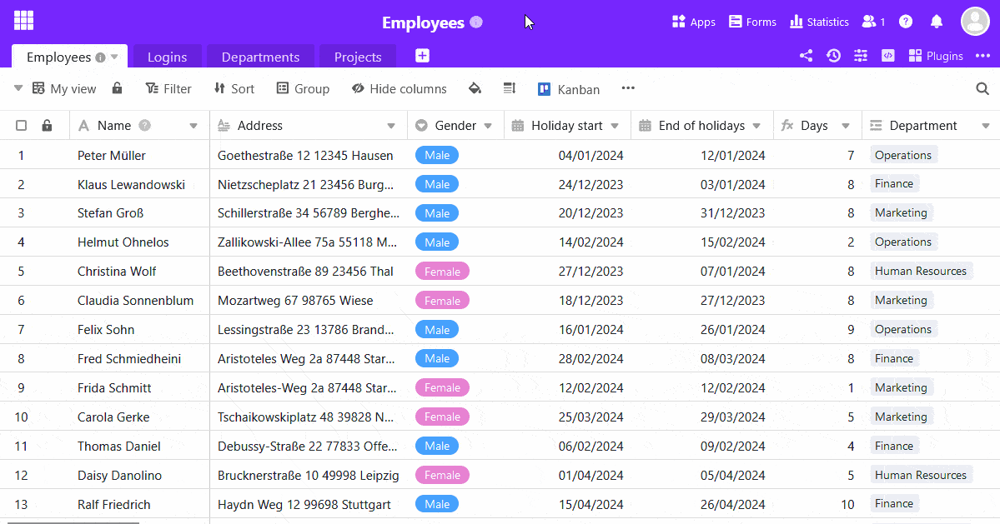

Um **formulário Web** converte a sua tabela num formulário com campos abertos. Uma coluna na sua tabela corresponde a um campo no formulário Web associado.

O **clássico formulário web** é ideal para inquéritos online e recolha estruturada de novos dados, uma vez que pode guiar os utilizadores através do processo de conclusão.

Para acesso, crie uma **ligação** que permita aos utilizadores **sem uma conta de utilizador SeaTable** introduzir dados no formulário Web.

Pode ler mais sobre [formulários web]() no artigo ligado.

## Para criar um formulário web

1. Abra a gestão de formulários através do botão  **web forms** no canto superior direito do cabeçalho da base.
2. Seleccione **Criar formulário Web** na nova janela na parte inferior e clique em **Formulário clássico**.
3. Dar um **nome** ao formulário e confirmar com **Submeter**.
4. Da primeira vez que o fizer, o **editor de formulários Web** abre-se automaticamente. Da próxima vez, clique no **ícone de lápis**  à direita do nome do formulário para abrir o editor.
5. No lado direito tem algumas opções para personalizar as **configurações**, **conteúdo** e **aparência do** formulário web. **Arraste e largue** os campos da tabela no seu desenho ou clique no **símbolo mais** à direita do nome da coluna para os incorporar no formulário.
   7. Clique no botão da **página do formulário Web** no canto superior direito para visualizar uma **pré-visualização**.
6. Clique no botão **Partilhar** no canto superior direito para criar **ligações** que pode enviar aos utilizadores do formulário.
