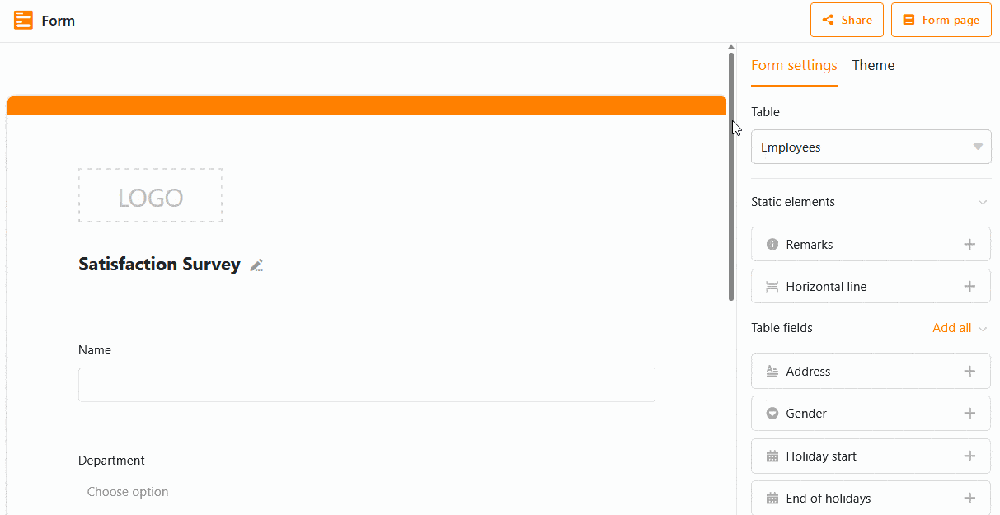

Al crear **formularios web**, puede establecer que determinados **campos** sólo sean visibles cuando se cumpla una **condición** en un campo anterior. Esto permite mejorar la **experiencia del usuario** al rellenar el formulario.

## Establecer condición para un campo de formulario

1. Abra un **formulario web** existente.
2. Haga clic en un campo para abrir la **configuración** del mismo.
3. Activa el control **Mostrar campo sólo cuando se cumplan las condiciones**.
4. Seleccione el **campo anterior** al que debe referirse la condición.
5. A continuación, establezca la **condición.** Dependiendo del tipo de columna subyacente, tiene diferentes opciones para elegir.



## Ejemplo de aplicación

Supongamos que quiere realizar una encuesta de satisfacción de los empleados de su empresa. Por ejemplo, quiere hacer la pregunta "¿Cuál es su grado de satisfacción con nuestro programa de leasing de vehículos de empresa?", pero sabe que sólo se ofrece un vehículo de empresa a los empleados que ocupan puestos directivos. Por lo tanto, sólo quiere hacer esta pregunta a los directivos.

En primer lugar, debe crear una [columna de]() valoración en su tabla y añadirla como **campo** en su formulario web. A continuación, añada la **condición** de que el campo de valoración sólo se muestre si se ha seleccionado la opción "Jefe de" o "Jefe de equipo" en el **campo de selección** anterior **"Cargo"**. El campo de selección debe ser **obligatorio**, ya que, de lo contrario, los directivos que dejen este campo en blanco no verán la pregunta sobre el renting de vehículos de empresa.
