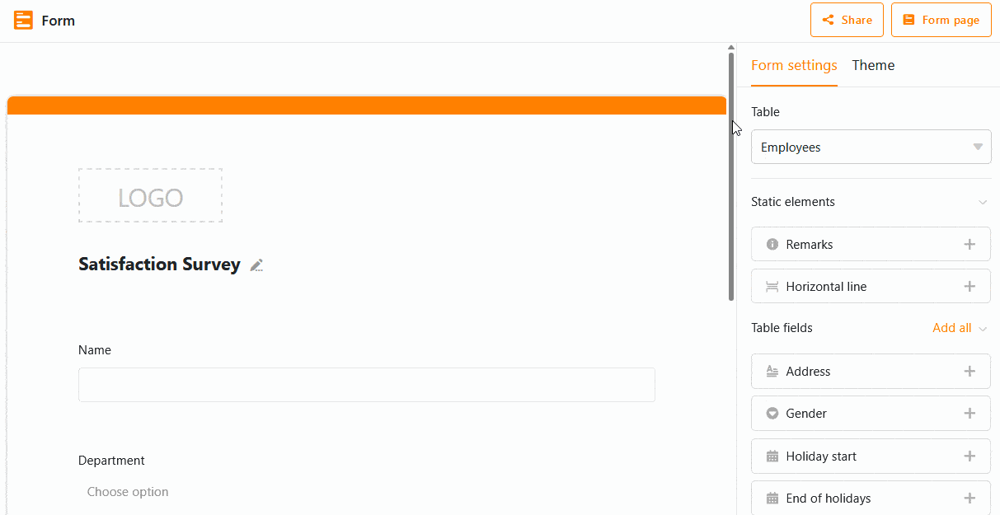

Lors de la création de **formulaires web**, vous pouvez faire en sorte que certains **champs** ne soient visibles que lorsqu'une **condition** a été remplie dans un champ précédent. Cela permet d'améliorer le **guidage de l'utilisateur** lorsqu'il remplit le formulaire.

## Définir une condition pour un champ de formulaire

1. Ouvrez un **formulaire web** existant.
2. Cliquez sur un champ pour ouvrir les **paramètres du champ**.
3. Activez le curseur **Afficher le champ uniquement si les conditions sont remplies**.
4. Sélectionnez le **champ précédent** auquel la condition doit se référer.
5. Définissez ensuite la **condition**. Selon le type de colonne sous-jacent, vous avez le choix entre différentes options.



## Exemple d'application

Supposons que vous souhaitiez réaliser une enquête sur la satisfaction des employés de votre entreprise. Vous souhaitez par exemple poser la question suivante : "Êtes-vous satisfait de notre service de location de voitures de société ?", mais vous savez que seuls les cadres supérieurs se voient proposer une voiture de société. Vous souhaitez donc poser cette question uniquement à vos cadres supérieurs.

Tout d'abord, vous devez créer une [colonne de rating]() dans votre tableau et l'intégrer comme **champ** dans votre formulaire web. Ajoutez ensuite la **condition** que le champ de notation ne s'affiche que si l'option "Head of" ou "Team lead" a été sélectionnée dans le **champ de sélection** précédent **"Position"**. Ce faisant, le champ de sélection devrait exiger une **saisie obligatoire**, sinon même les cadres qui laissent ce champ libre ne verront pas s'afficher la question sur le leasing de voitures de société.
