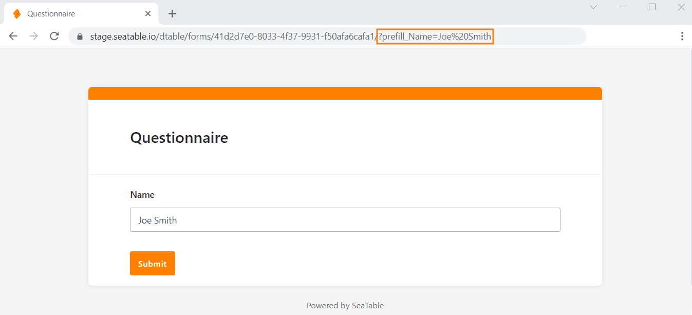

Um **Webformulare vorzubefüllen**, haben Sie die Möglichkeit, Standardwerte in den Formularfeldern zu definieren. Dies können Sie direkt in der URL machen oder mithilfe einer benutzerfreundlichen Funktion in SeaTable.

## Formularlink mit Standardwerten in SeaTable generieren

SeaTable bietet eine Funktion, mit der Sie bequem **Formularlinks** generieren können, in denen Standardwerte bereits vorab definiert sind.

1. Erstellen Sie ein [Webformular](https://seatable.io/docs/webformulare/webformulare/).
2. Klicken Sie im Webformular-Editor auf die Schaltfläche  **Freigeben** in der rechten oberen Ecke.
3. Klicken Sie nun auf die Schaltfläche **Formular-Link hinzufügen** und folgende Eingabemaske erscheint:
5. Geben Sie dem neuen Link einen **Namen**. Unter **Eigene URL** können Sie einen Teil der URL selbst definieren.
6. Um ein Formularfeld mit einem Standardwert vorzubefüllen, klicken Sie auf **Feld hinzufügen**. Wählen Sie aus dem Drop-down-Menü das **Formularfeld** aus und tragen Sie den gewünschten **Standardwert** ein.
7. Zuletzt können Sie noch entscheiden, ob der Standardwert beim Ausfüllen des Formulars geändert werden kann. Wählen Sie dazu **Lesen und Schreiben**. Wenn Sie **nur Lesen** wählen, bleibt der Wert im Formular unveränderlich.
8. Klicken Sie auf **Erstellen**, um den Link zu generieren.

Das Ergebnis, also die erweiterte URL, ist das gleiche wie bei der unten beschriebenen manuellen Vorgehensweise.

## Vorbefüllen eines Webformulars direkt über die URL

1. Erstellen Sie ein [Webformular](https://seatable.io/docs/webformulare/webformulare/).
2. Klicken Sie im Webformular-Editor auf die Schaltfläche  **Freigeben**, um den Link zu dem Webformular zu erhalten.
3. **Kopieren** Sie den Link und fügen Sie ihn in einem neuen Tab **in die Suchzeile des Browsers** ein, wo Sie ihn bearbeiten und testen können.
4. Um ein Formularfeld mit einem Standardwert vorzubefüllen, hängen Sie die Zeichenfolge **/?prefill\_COLUMNNAME=PREFILLVALUE‘** an den Formularlink an.

Anstelle von **COLUMNNAME** setzen Sie den Namen des Feldes ein, das Sie ausfüllen möchten; bei **PREFILLVALUE** setzen Sie den gewünschten Standardwert ein. Leerzeichen sind als **%20** zu schreiben. Achten Sie auf Groß- und Kleinschreibung.

**Beispiel**: Wenn Sie Joe Smith ein personalisiertes Webformular schicken möchten, in dem sein Name bereits eingetragen ist, hängen Sie an den Formularlink die Zeichenfolge **/?prefill\_Name=Joe%20Smith** an.

Um **mehrere Standardwerte** einzusetzen, verketten Sie die Prefill-Eingaben durch ein **&**\-Zeichen: /?prefill\_COLUMNNAME=PREFILLVALUE**&**prefill\_COLUMNNAME=PREFILLVALUE

Sobald Sie fertig sind, können Sie den Link testen, indem Sie die **Enter-Taste** drücken und das Webformular aufrufen. Wenn alles geklappt hat, können Sie in dieser **Vorschau** die vorausgefüllten Standardwerte sehen.

## Vorbefüllbare Formularfelder

Je nachdem, welcher Spaltentyp einem Formularfeld zugrundeliegt, ist das Vorbefüllen nicht immer möglich. In der folgenden Übersicht können Sie ablesen, welche Spaltentypen das Vorausfüllen per URL erlauben und welche nicht.

\[table id=48 /\]
