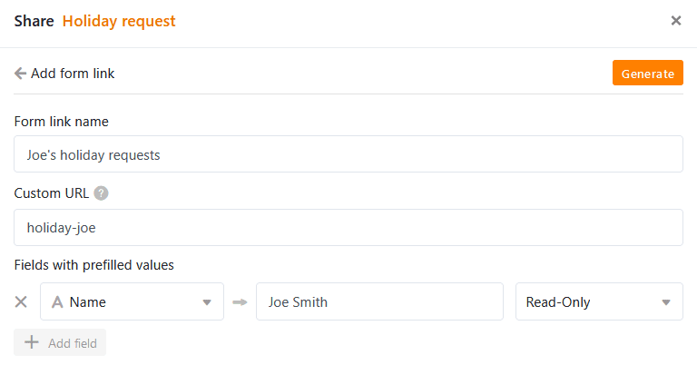
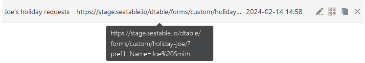
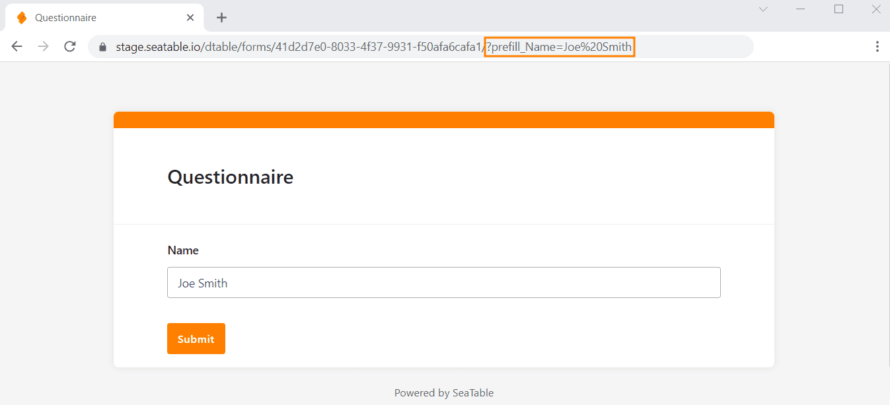

To **prefill web forms**, you have the option of defining default values in the form fields. You can do this directly in the URL or using a user-friendly function in SeaTable.

## Generate form link with default values in SeaTable

SeaTable offers a function with which you can easily generate **form links** in which default values are already defined in advance.

1. Create a [web form](https://seatable.io/en/docs/webformulare/webformulare/).
2. In the web form editor, click on the  **Share** button in the top right-hand corner.
3. Now click on the **Add form link** button and the following input mask will appear:

5. Give the new link a **name**. Under **Custom URL** you can define part of the URL yourself.
6. To pre-fill a form field with a default value, click on **Add field**. Select the form **field** from the drop-down menu and enter the desired default **value**.
7. Finally, you can decide whether the default value can be changed when filling out the form. To do this, select **Read and Write**. If you select **Read only**, the value in the form remains unchangeable.
8. Click on **Create** to generate the link.

The result, i.e. the extended URL, is the same as with the manual procedure described below.

## Prefilling a web form directly from the URL

1. Create a [web form](https://seatable.io/en/docs/webformulare/webformulare/).
2. Click on the  **Share** button in the web form editor to receive the link to the web form.
3. **Copy** the link and paste it in a new tab in the **browser search bar**, where you can edit and test it.
4. To **prefill** a form field with a default value, append the string **/?prefill\_COLUMNAME=PREFILLVALUE'** to the form link.

Instead of **COLUMNNAME** put the name of the field you want to fill in; for **PREFILLVALUE** put the desired default value. Spaces are to be written as **%20**. Pay attention to upper and lower case.

**Example:** If you want to send Joe Smith a personalized web form with his name already filled in, append the string **/?prefill\_name=Joe%20Smith** to the form link.

To use **multiple default values**, concatenate the prefill entries with an **& character**: /?**prefill\_COLUMNAME=PREFILLVALUE&prefill\_COLUMNAME=PREFILLVALUE**

Once you are done, you can test the link by pressing the **Enter key** and opening the web form. If everything worked, you can see the pre-filled default values in this **preview**.

## Prefillable form fields

Depending on which column type a form field is based on, pre-filling is not always possible. In the following overview you can see which column types allow prefilling via URL and which do not.

| Column type | Supports prefilling |
| --- | --- |
| Automatic number |  |
| Image |  |
| Checkbox |  |
| File |  |
| Date |  |
| Duration |  |
| Single selection |  |
| E-mail |  |
| Creator |  |
| Created |  |
| Formatted text |  |
| Formula |  |
| Formula for links |  |
| Geoposition |  |
| Last editor |  |
| Multiple selection |  |
| Employees |  |
| Rating |  |
| Button |  |
| Signature |  |
| Text |  |
| URL |  |
| Number |  |
| Last edited |  |
