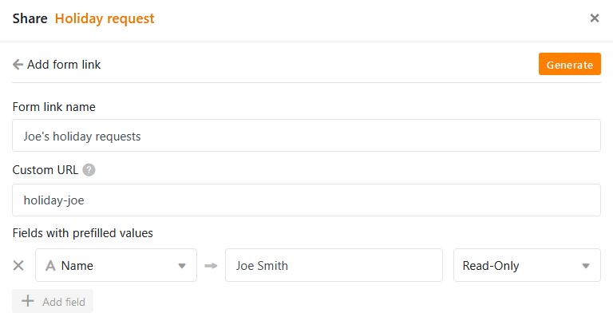
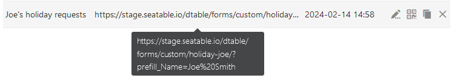

Pour **pré-remplir les formulaires web**, vous avez la possibilité de définir des valeurs par défaut dans les champs du formulaire. Vous pouvez le faire directement dans l'URL ou à l'aide d'une fonction conviviale dans SeaTable.

## Générer un lien de formulaire avec des valeurs par défaut dans SeaTable

SeaTable propose une fonction qui permet de générer facilement **des liens de formulaire** dans lesquels les valeurs par défaut sont prédéfinies.

1. Créez un [formulaire web](https://seatable.io/fr/docs/webformulare/webformulare/).
2. Dans l'éditeur de formulaire web, cliquez sur le bouton  **Partager** dans le coin supérieur droit.
3. Cliquez maintenant sur le bouton **Ajouter un lien de formulaire** et le masque de saisie suivant apparaît :

5. Donnez un **nom** au nouveau lien. Sous **Propre URL**, vous pouvez définir vous-même une partie de l'URL.
6. Pour pré-remplir un champ de formulaire avec une valeur standard, cliquez sur **Ajouter un champ**. Sélectionnez le **champ de formulaire** dans le menu déroulant et saisissez la **valeur par défaut** souhaitée.
7. Enfin, vous pouvez encore décider si la valeur par défaut peut être modifiée lorsque le formulaire est rempli. Pour cela, sélectionnez **Lire et Écrire**. Si vous choisissez **uniquement la lecture**, la valeur reste inchangée dans le formulaire.
8. Cliquez sur **Créer** pour générer le lien.

Le résultat, c'est-à-dire l'URL étendue, est le même que celui de la procédure manuelle décrite ci-dessous.

## Pré-remplissage d'un formulaire web directement via l'URL

1. Créez un [formulaire web](https://seatable.io/fr/docs/webformulare/webformulare/).
2. Dans l'éditeur de formulaire web, cliquez sur le bouton  **Partager** pour obtenir le lien vers le formulaire web.
3. **Copiez** le lien et collez-le dans un nouvel onglet dans **la ligne de recherche du navigateur**, où vous pourrez le modifier et le tester.
4. Pour pré-remplir un champ de formulaire avec une valeur standard, ajoutez la chaîne de caractères **/?prefill_COLUMNNAME=PREFILLVALUE'** au lien du formulaire.

Au lieu de **COLUMNNAME**, insérez le nom du champ que vous souhaitez remplir ; pour **PREFILLVALUE**, insérez la valeur standard souhaitée. Les espaces doivent être écrits sous la forme **%20**. Veillez à respecter les majuscules et les minuscules.

**Exemple**: Si vous souhaitez envoyer à Joe Smith un formulaire web personnalisé dans lequel son nom est déjà inscrit, ajoutez la chaîne **/?prefill_Name=Joe%20Smith** au lien du formulaire.

Pour utiliser **plusieurs valeurs par défaut**, concaténer les entrées de pré-remplissage avec le **signe &**: /?**prefill_COLUMNNAME=PREFILLVALUE&prefill_COLUMNNAME=PREFILLVALUE**

Une fois que vous avez terminé, vous pouvez tester le lien en appuyant sur la **touche "Entrée"** et en affichant le formulaire web. Si tout s'est bien passé, vous pouvez voir dans cet **aperçu** les valeurs par défaut pré-remplies.

## Champs de formulaire préremplissables

Selon le type de colonne sur lequel repose un champ de formulaire, le pré-remplissage n'est pas toujours possible. Dans l'aperçu suivant, vous pouvez voir quels types de colonnes permettent le pré-remplissage par URL et lesquels ne le permettent pas.

| Type de colonne        | soutient le pré-remplissage |
| ---------------------- | --------------------------- |
| Numéro automatique     |                             |
| Image                  |                             |
| Case à cocher          |                             |
| Fichier                |                             |
| Date                   |                             |
| Durée                  |                             |
| Sélection unique       |                             |
| Courriel :             |                             |
| Créateur               |                             |
| Créé                   |                             |
| Texte formaté          |                             |
| Formule                |                             |
| Formule pour les liens |                             |
| Géoposition            |                             |
| Dernier responsable    |                             |
| Sélection multiple     |                             |
| Employés               |                             |
| Rating                 |                             |
| Bouton                 |                             |
| Signature              |                             |
| Texte                  |                             |
| URL                    |                             |
| Nombre                 |                             |
| Dernièrement édité     |                             |
