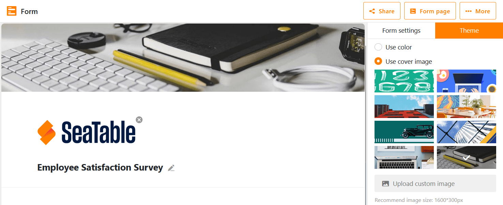

Sie können Ihr Webformular optisch, inhaltlich und funktional konfigurieren, indem Sie die **Formulareinstellungen**, die **Einstellungen der Felder** und das **Farbschema** anpassen. Letzteres erfordert ein Enterprise-Abonnement.

## Formulareinstellungen

- Falls Ihre Base aus mehreren Tabellen besteht, können Sie die **Tabelle** auswählen, für die Sie das Formular anlegen wollen.
- Ziehen Sie **statische Elemente** und **Tabellenfelder** per **Drag-and-Drop** in das Formular oder klicken Sie auf das **Plus-Symbol** rechts neben den Namen.
- Wenn Sie Hilfetexte zum Ausfüllen der Formularfelder einfügen möchten, können Sie die **Schriftfarbe der Hilfetexte** definieren.
- Sie können zwischen zwei **Benachrichtigungsregeln** wählen: Entweder werden keine Benachrichtigungen versendet oder Sie legen einen Empfänger (z. B. sich selbst) fest, der eine Benachrichtigung erhält, wenn ein Formular eingereicht wird.
- Sie haben die Möglichkeit, die **Zugriffsberechtigungen** nur auf in SeaTable angemeldete Benutzer einzuschränken.
- Mit einem Klick können Sie definieren, dass alle Felder erforderliche **Pflichtfelder** sein sollen, die von den Nutzern ausgefüllt werden müssen.
- Sie können "Powered by" über einen Regler ein- und ausblenden.
- Fügen Sie eine **Standardnachricht** hinzu, die ein Nutzer angezeigt bekommt, nachdem er das Formular abgesendet hat.
- Nach Abschluss des Formulars können Sie eine **Weiterleitung zu einer Webseite** (beispielsweise einer Danke-Webseite oder Homepage) aktivieren.
- Mit einer **Einreichungsfrist** beschränken Sie, wie lange der Formularlink gültig ist.

## Feldeinstellungen

Klicken Sie ein Feld an, um auf der rechten Seite mehr Einstellungsmöglichkeiten zu haben.

- Sie können einen vom Spaltennamen abweichenden **Feldnamen** angeben, der im Formular angezeigt werden soll. Auf diese Weise ist es möglich, die Spalten in der Tabelle völlig losgelöst vom Webformular zu benennen.
- Schreiben Sie im **Hilfetext** Anweisungen oder Erklärungen zum Ausfüllen des jeweiligen Feldes auf.
- Entscheiden Sie, ob es sich bei dem jeweiligen Feld um ein **erforderliches Pflichtfeld** handelt oder nicht. Wenn Sie diese Einstellung durch den **Regler** aktivieren, müssen die Nutzer das Feld ausfüllen, um das Formular einreichen zu können.
- Entscheiden Sie, ob das jeweilige Feld mit einem **Standardwert** vorbefüllt werden soll oder nicht. Sie können durch einen weiteren **Regler** aktivieren, dass die Ausfüllenden diesen Wert nicht ändern können.
- Legen Sie fest, ob ein Feld nur angezeigt werden soll, wenn vorherige Felder bestimmte **Bedingungen** erfüllen. Dies ermöglicht eine genauere Benutzerführung, da irrelevante Felder im Ausfüllprozess ausgeblendet bleiben.

Sie können die Reihenfolge der Felder im Webformular beliebig verändern, indem Sie auf das **Sechs-Punkte-Symbol**  in der rechten Ecke eines Feldes klicken und das Feld per Drag-and-Drop an die gewünschte Stelle ziehen.

Um ein Feld wieder aus dem Formular zu entfernen, klicken Sie an der gleichen Stelle auf das **Papierkorb-Symbol** .

## Farbschema und Logo



Besonders für Unternehmen und Organisationen kann es interessant sein, ein Webformular dem Corporate Design entsprechend zu individualisieren.

Dazu können Sie Ihr Formular mit Ihrem **Logo** branden.

Zudem haben Sie die Möglichkeit, den oberen **Farbbalken** anzupassen. Klicken Sie dafür oben rechts neben den Einstellungen auf **Farbschema**.

Alternativ zu dem Farbbalken können Sie auch ein **Titelbild** hinzufügen.

