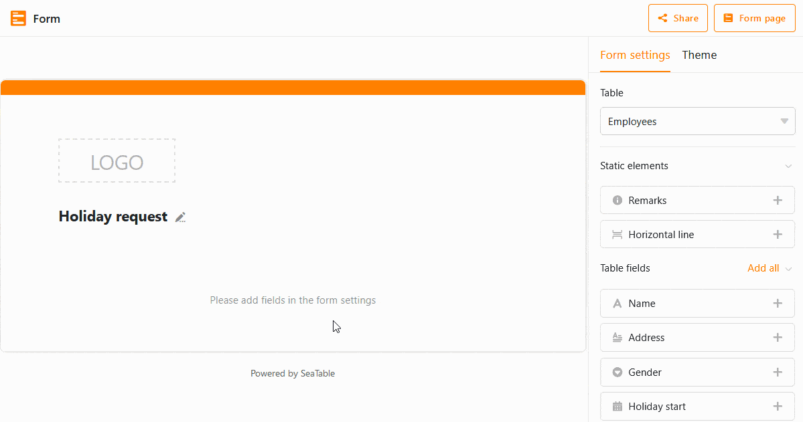

You can configure the look, content, and functionality of your web form by customizing the **form** settings, **field settings**, and **color scheme**. The latter requires an Enterprise subscription.

## Form settings

- If your base consists of several tables, you can select the **table** for which you want to create the form.
- **Drag and** drop **static elements** and **table fields** into the form or click the **plus** icon to the right of their names.
- If you want to insert help texts to fill in the form fields, you can define the **font color of the help texts**.
- You can choose between two **notification rules**: Either no notifications are sent or you specify a recipient (e.g. yourself) who receives a notification when a form is submitted.
- You have the option to restrict **access permissions** only to users logged into SeaTable.
- With one click you can define that all fields should be required **mandatory fields** that must be filled by users.
- You can show and hide "Powered by" via a slider.
- Add a **default message** that a user will see after submitting the form.
- After completing the form, you can activate a **redirect to a web** page (for example, a thank you web page or homepage).
- With a **submission deadline**, you limit how long the form link is valid.

## Field settings

Click a field to have more setting options on the right side.

- You can specify a **field name** different from the column name to be displayed in the form. In this way it is possible to name the columns in the table completely detached from the web form.
- In the **help text**, write down instructions or explanations on how to fill in the respective field.
- Decide whether the particular field is a **required mandatory field** or not. If you enable this setting by the **slider**, users will have to fill in the field to be able to submit the form.
- Decide whether the respective field should be prefilled with a **default value** or not. You can activate by another **slider** that the fillers cannot change this value.
- Specify whether a field should only be displayed if previous fields meet certain **conditions**. This allows for more accurate user guidance, as irrelevant fields remain hidden in the filling process.

You can change the order of the fields in the web form as you wish by clicking the **six-dot icon**  in the right corner of a field and dragging and dropping the field to the desired location.

To remove a field from the form again, click on the **trash can icon**  at the same place.

## Color scheme and logo



Especially for companies and organizations it can be interesting to individualize a web form according to the corporate design.

For this purpose, you can brand your form with your **logo**.

You also have the option to customize the top **color bar**. To do so, click **Color Scheme** in the upper right corner next to Settings.

As an alternative to the color bar, you can also add a **title image**.

