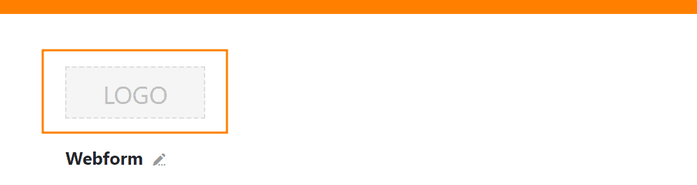

Вы можете настроить внешний вид, содержание и функциональность веб-формы, настроив **параметры формы**, **параметры полей** и **цветовую схему**. Для последнего требуется подписка Enterprise.

## Настройки формы

- Если ваша База состоит из нескольких таблиц, вы можете выбрать **таблицу**, для которой вы хотите создать форму.
- **Перетащите** **статические элементы** и **поля таблицы** в форму или нажмите на **символ плюса** справа от их названий.
- Если вы хотите вставить тексты подсказок для заполнения полей формы, вы можете определить **цвет шрифта текстов подсказок**.
- Вы можете выбрать одно из двух **правил уведомления**: Либо уведомления не отправляются, либо вы указываете получателя (например, себя), который получает уведомление, когда форма отправлена.
- У вас есть возможность ограничить **права доступа** только для пользователей, вошедших в SeaTable.
- Одним щелчком мыши вы можете определить, что все поля должны быть обязательными **для** заполнения пользователями.
- Показывать и скрывать надпись "Powered by" можно с помощью ползунка.
- Добавьте **сообщение по умолчанию**, которое пользователь увидит после отправки формы.
- После заполнения формы можно активировать **перенаправление на веб-сайт** (например, сайт благодарности или домашнюю страницу).
- Установив **срок подачи**, вы ограничиваете время действия ссылки на форму.

## Настройки поля

Нажмите на поле, чтобы получить дополнительные параметры настройки с правой стороны.

- Вы можете указать **имя поля**, которое отличается от имени столбца, отображаемого в форме. Таким образом можно дать имя столбцам в таблице совершенно отдельно от веб-формы.
- В **тексте справки** напишите инструкции или объяснения, как заполнить соответствующее поле.
- Определите, является ли соответствующее поле **обязательным** для заполнения или нет. Если вы активируете этот параметр с помощью **ползунка**, пользователи должны заполнить поле, чтобы отправить форму.
- Решите, следует ли предварительно заполнять соответствующее поле **значением по умолчанию** или нет. Вы можете использовать другой **ползунок** для активации того, чтобы человек, заполняющий поле, не мог изменить это значение.
- Укажите, должно ли поле отображаться только в том случае, если предыдущие поля удовлетворяют определенным **условиям**. Это позволяет более точно ориентировать пользователя, поскольку неактуальные поля остаются скрытыми в процессе заполнения.

Вы можете изменить порядок расположения полей в веб-форме по своему усмотрению, нажав на **символ с шестью точками**  в правом углу поля и перетащив поле в нужное место.

Чтобы снова удалить поле из формы, нажмите на **символ корзины**  в том же месте.

## Цветовая схема и логотип



Особенно для компаний и организаций может быть интересно индивидуализировать веб-форму в соответствии с корпоративным дизайном.

Вы можете украсить форму своим **логотипом**.

У вас также есть возможность настроить верхнюю **цветовую полосу**. Для этого нажмите на **Цветовую схему** в правом верхнем углу рядом с Настройками.

В качестве альтернативы цветовой полосе можно добавить **изображение заголовка**.

