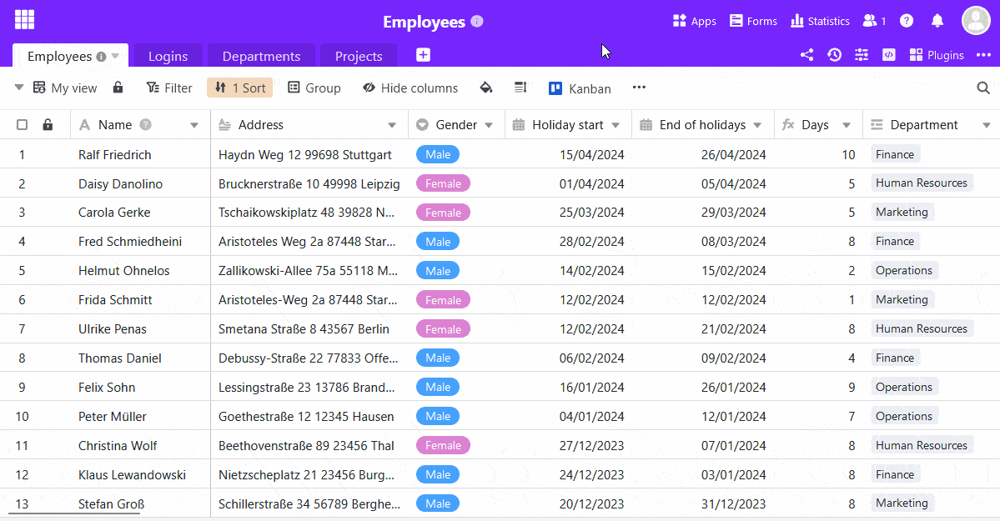

Los **formularios web** son la herramienta elegida para que los miembros del equipo y terceros externos introduzcan nuevos registros en sus tablas. Los usuarios acceden a un formulario a través de un **enlace**, por lo que **no** es necesario compartir la tabla. Por lo tanto, los formularios web son especialmente adecuados para la introducción de datos por parte de un gran número de **personas dentro y fuera de su equipo**.

Familiarícese con la función de formularios de SeaTable para recopilar datos cómodamente a través de formularios web.

## Funcionamiento de los formularios web

El formulario web clásico es ideal para **encuestas en línea** y recopilación estructurada de nuevos datos. Las columnas de la tabla se integran mediante **campos de formulario** y los usuarios son guiados a través del proceso de cumplimentación. Para el acceso, cree un enlace que permita a los usuarios **sin cuenta de usuario SeaTable** rellenar el formulario web. Un formulario web cumplimentado corresponde a **un registro** o una fila añadida en la tabla correspondiente.

Los formularios web siempre hacen referencia a una **tabla** de la Base abierta. Por lo tanto, debe abrir primero la tabla y la vista correspondientes antes de crear un formulario. Puede crear y guardar **cualquier número de** formularios web en cada base.

## Crear un formulario

Abra la gestión de formularios a través del botón  **formularios** situado en la parte superior derecha de la cabecera de la Base. Si aún no se ha creado ningún formulario en la Base, la gestión de formularios aparecerá como una lista vacía. En caso contrario, los formularios existentes se mostrarán en la ventana abierta.

Para crear un nuevo formulario web, haga clic en la parte inferior de la administración de formularios y, a continuación, seleccione **Formulario clásico**.

Introduzca ahora el **nombre** del nuevo formulario web, que también se mostrará en la administración de formularios. Utilice un nombre conciso para no perder de vista muchos formularios. Por supuesto, puede adaptar el nombre más adelante.

Haciendo clic en el **icono del lápiz**  se abre el **editor de formularios web** con su vista en dos partes: a la izquierda se muestra el formulario web en modo borrador, donde dispone de numerosas opciones para editar los campos del formulario; a la derecha están los **ajustes**.

Existen numerosas [opciones de configuración]() para adaptar rápida y fácilmente un formulario web a sus deseos e ideas.

Puede realizar las siguientes elecciones utilizando la **configuración del formulario** web de la derecha:

- ¿A qué **tabla** está vinculado el formulario?
- ¿Qué **elementos estáticos** y **campos de** tabla desea incluir en el formulario?
- ¿Debería enviarse una **notificación** (a usted) cuando se envíe el formulario?
- ¿Quién puede **acceder** al formulario?
- ¿Deben ser **obligatorios** todos los campos?
- ¿Debe aparecer "Powered by"?
- ¿Qué **mensaje** se muestra al participante después de enviar el formulario?
- ¿Desea **redirigir** al participante a **un sitio web** después de enviar el formulario?
- ¿Tiene el formulario una **fecha límite de presentación**?

Los campos disponibles en el formulario dependen de las **columnas** de la tabla seleccionada. Si añade o elimina columnas en la tabla, los campos disponibles en la configuración se ajustan automáticamente. Los **nombres** y el **orden de** los campos se toman directamente de la tabla subyacente.

**Arrastre y suelte** los campos de la tabla en su diseño o haga clic en el **símbolo más** a la derecha del nombre de la columna. Puede cambiar el orden de los campos en el formulario web como desee haciendo clic en el **símbolo de seis puntos**  en la esquina derecha de un campo y arrastrando y soltando el campo en la posición deseada.



En el borrador, puede hacer clic en cada campo, lo que le llevará a la **configuración del campo**. Para cada campo puede especificar si...

- se debe mostrar en el formulario un **nombre de campo** distinto del nombre de la columna,
- un campo recibe una **nota de finalización** suplementaria,
- un campo es **obligatorio**,
- un campo debe contener un **valor por defecto**,
- la visualización del campo depende de una **condición**.



Para comprobar qué aspecto tiene el formulario para el destinatario, haga clic en el botón **Página del formulario** web de la esquina superior derecha. El formulario se abrirá en una nueva pestaña tal y como lo vería otro usuario.

## Compartir el formulario

Para que otras personas puedan acceder al formulario, necesita un **enlace**. Puede obtener el enlace para el formulario en el editor de formularios web a través del botón **Compartir** . Puede utilizar el **enlace generado automáticamente** o crear **sus propios enlaces** y añadirles [valores prefijados]().



Antes de enviar el enlace del formulario o hacerlo accesible al público, debe probarlo exhaustivamente.

## Comprobar el formulario

Las pruebas exhaustivas evitan la frustración de los destinatarios. Los problemas pueden deberse a ambigüedades o conflictos en el formulario. En el peor de los casos, un formulario no puede enviarse porque no puede rellenarse un campo obligatorio (por ejemplo, si no se definen valores para una única opción).

Abra el formulario web para probarlo. Desde el editor de formularios web, esto se hace a través del botón **Página** de formulario web. Desde la vista de tabla, llame primero a la administración de formularios y, a continuación, haga clic en el nombre del formulario web. En ambos casos, el formulario web se abre en una nueva pestaña del navegador.

Los valores introducidos en el formulario se guardan en la tabla vinculada. No olvide volver a borrar los datos de prueba de la tabla antes de recoger los datos más adelante.

## Modificar el formulario

Puede modificar los formularios web en cualquier momento utilizando el editor de formularios web. Para volver al editor, abra la administración de formularios, sitúe el puntero del ratón sobre el nombre del formulario y, a continuación, haga clic en el **icono del lápiz** situado a la derecha del nombre .

## Borrar el formulario

Puede eliminar formularios web en cualquier momento a través de la administración de formularios. Mueva el puntero del ratón hasta el nombre del formulario y, a continuación, haga clic en el **icono de la papelera** situado a la derecha del nombre .
