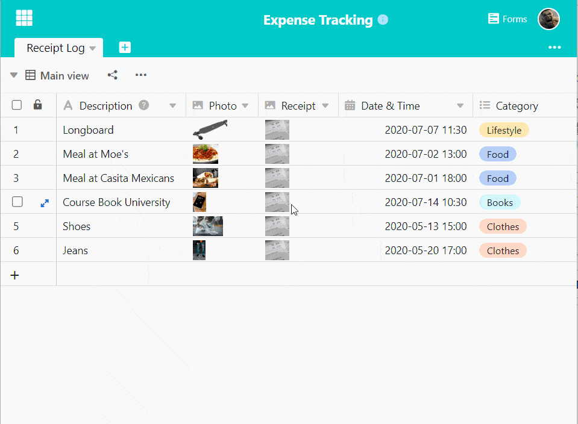
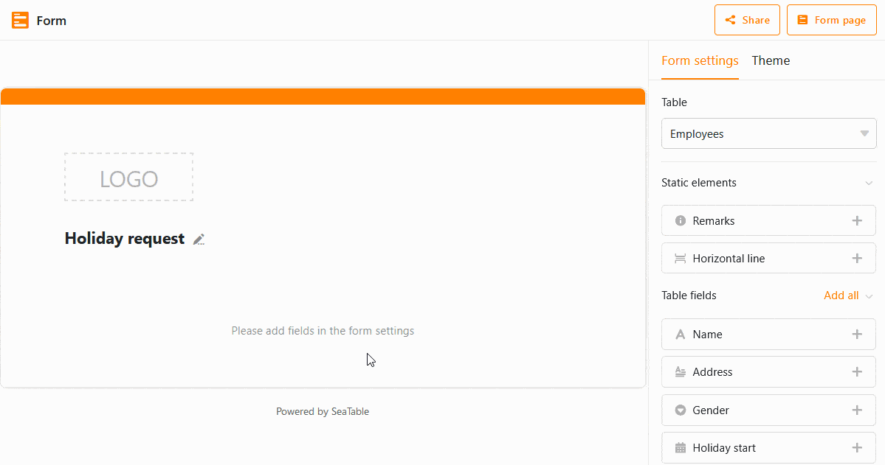
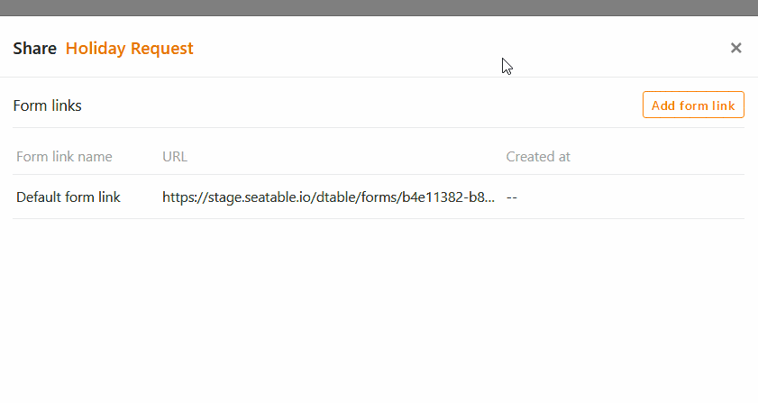
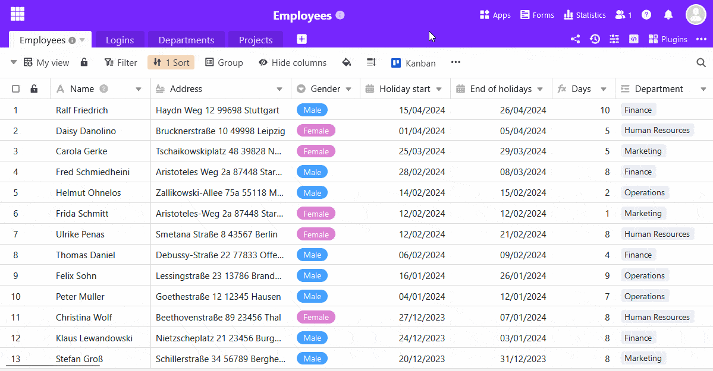

Os **formulários Web** são o instrumento de eleição para permitir aos membros da equipa e a terceiros externos introduzir novos registos nas suas tabelas. Os utilizadores acedem a um formulário através de um **link**, pelo que **não** há necessidade de partilhar a tabela. Portanto, os formulários web são particularmente adequados para a introdução de dados por um grande número de **pessoas dentro e fora da sua equipa**.

Familiarize-se com a funcionalidade do formulário SeaTable para recolher convenientemente dados através de formulários web!

## Funcionamento de formulários web

O formulário web clássico é ideal para **inquéritos em linha** e recolha estruturada de novos dados. As colunas da tabela são integradas utilizando **campos do formulário** e os utilizadores são guiados através do processo de preenchimento. Para acesso, criar uma ligação que permita aos utilizadores **sem conta de utilizador SeaTable** preencher o formulário web. Um formulário web preenchido corresponde a **um registo** ou a uma linha adicionada na tabela correspondente.

Os formulários da Web referem-se sempre a uma **tabela** na Base aberta. Por conseguinte, é necessário primeiro abrir a tabela relevante e visualizar antes de criar um formulário. Pode criar e guardar **qualquer número** de formulários da Web em cada base.

## Criar um formulário

Abrir a gestão de formulários através do botão  **Forms** no canto superior direito do cabeçalho da Base. Se ainda não tiverem sido criados formulários na base, a gestão de formulários aparecerá como uma lista vazia. Caso contrário, os formulários existentes são apresentados na janela aberta.

Cria um novo formulário web clicando em **Criar formulário** na parte inferior da administração do formulário e seleccionando em seguida **Formulário clássico**.

Introduza agora o **nome do** novo formulário web, que também é exibido na administração do formulário. Use um nome conciso para manter o registo de muitos formulários. Naturalmente, ainda é possível adaptar o nome mais tarde.

Clicando no **ícone do lápis**  abre o **editor de formulários web** com a sua vista em duas partes: à esquerda, o formulário web é exibido em modo de rascunho, onde tem inúmeras opções para editar os campos do formulário; à direita estão as **definições**.

Existem numerosas [opções de configuração]() para adaptar rápida e facilmente um formulário web aos seus desejos e ideias.

Pode fazer as seguintes escolhas usando as **definições do formulário web** à direita:

- A que **tabela** está ligado o formulário?
- Que **elementos estáticos** e **campos de tabela** pretende incluir no formulário?
- Deve ser enviada (para si) uma **notificação** quando o formulário for submetido?
- Quem pode **aceder** ao formulário?
- Todos os campos devem ser **obrigatórios**?
- Deverá ser apresentada a indicação "Powered by"?
- Que **mensagem** é apresentada ao participante após o envio do formulário?
- Deseja **redireccionar** o participante para **um website** depois de submeter o formulário?
- O formulário tem um **prazo de entrega**?

Os campos disponíveis no formulário dependem das **colunas** da tabela seleccionada. Se adicionar ou eliminar colunas na tabela, os campos disponíveis nas definições ajustam-se automaticamente. Os **nomes** e a **ordem dos** campos são retirados directamente da tabela subjacente.

**Arraste e largue** os campos da tabela para o seu desenho ou clique no **símbolo mais** à direita do nome da coluna. Pode alterar a ordem dos campos no formulário web como desejar, clicando no **símbolo de seis pontos**  no canto direito de um campo e arrastando e largando o campo para a posição desejada.



No rascunho, pode clicar em cada campo, o que o levará às **definições do campo**. Para cada campo, pode especificar se ...

- um **nome de campo** diferente do nome da coluna deve ser exibido no formulário,
- um campo recebe uma **nota de preenchimento** suplementar,
- um campo é um **campo obrigatório**,
- um campo deve conter um **valor por defeito**,
- a exibição do campo depende de uma **condição**.



Para verificar o aspecto do formulário para o destinatário, clicar no botão **Webform Page**, no canto superior direito. O formulário abre-se então num novo separador, como outro utilizador o veria.

## Partilhar o formulário

Para tornar o formulário acessível a outras pessoas, é necessário um **link**. Pode obter a ligação para o formulário no editor de formulários Web através do botão  **Partilhar**. Pode utilizar a **ligação gerada automaticamente** ou criar as **suas próprias ligações** e alargá-las com [valores pré-preenchidos]().



Antes de enviar a hiperligação do formulário ou de o tornar acessível ao público, deve testar exaustivamente o formulário.

## Testar o formulário

Os testes exaustivos evitam a frustração por parte dos beneficiários. Os problemas podem ser causados por ambiguidades ou conflitos na sua forma. No pior dos casos, um formulário não pode ser submetido porque um campo obrigatório não pode ser preenchido (por exemplo, se não forem definidos valores para uma única escolha).

Abrir o formulário web para testes. A partir do editor do formulário web, isto é feito através do botão **página de formulário**. A partir da vista da tabela, primeiro chamar a administração do formulário e depois clicar no nome do formulário web. Em ambos os casos, o formulário web abre-se num novo separador do navegador.

Os valores introduzidos no formulário são guardados na tabela ligada. Não se esqueça de apagar novamente os dados do teste da tabela antes de recolher os dados mais tarde.

## Editar o formulário

Pode editar formulários web em qualquer altura, utilizando o editor de formulários web. Para voltar ao editor, chamar a administração do formulário, mover o ponteiro do rato sobre o nome do formulário e depois clicar no **ícone do lápis** à direita do nome .

## Eliminar o formulário

Pode apagar formulários web a qualquer momento através da administração de formulários. Mova o ponteiro do rato para o nome do formulário e depois clique no **ícone da lixeira** à direita do nome .
