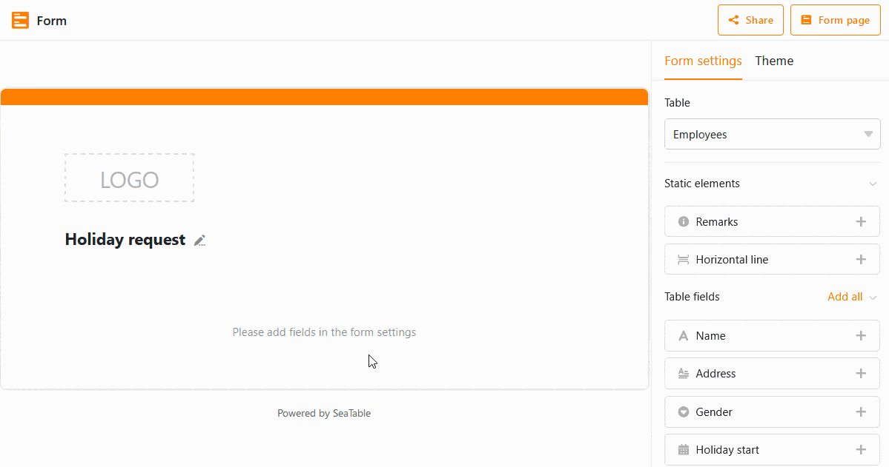

**Веб-формы** - это инструмент, позволяющий членам команды и внешним третьим лицам вводить новые записи в ваши таблицы. Пользователи получают доступ к форме по **ссылке**, поэтому **нет** необходимости предоставлять общий доступ к таблице. Поэтому веб-формы особенно подходят для ввода данных большим количеством **людей внутри и вне вашей команды**.

Познакомьтесь с функцией форм SeaTable для удобного сбора данных через веб-формы!

## функционирование веб-форм

Классическая веб-форма идеально подходит для **онлайн-опросов** и структурированного сбора новых данных. Столбцы таблицы интегрируются с **полями формы**, и пользователи проходят через процесс заполнения. Для доступа создайте ссылку, которая позволит пользователям **без учетной записи SeaTable** заполнить веб-форму. Заполненная веб-форма соответствует **записи** или добавленной строке в соответствующей таблице.

Веб-формы всегда ссылаются на **таблицу** в открытой Базе. Поэтому перед созданием формы необходимо сначала открыть соответствующую таблицу и представление. В каждой базе можно создать и сохранить **любое количество** веб-форм.

## Создайте форму

Откройте управление формами с помощью кнопки  **Веб-формы** правом верхнем углу шапки базы. Если в Базе еще не было создано ни одной формы, управление формами отобразится в виде пустого списка. В противном случае в открытом окне отобразятся все существующие формы.

Вы создаете новую веб-форму, нажав кнопку **Создать веб-форму** в нижней части администрирования форм, а затем выбрав **Классическая форма**.

Теперь введите **имя** новой веб-формы, которое также будет отображаться в администрировании формы. Используйте лаконичное имя, чтобы отслеживать множество форм. Конечно, вы можете изменить имя позже.

Щелчок на значке **карандаша**  открывает **редактор веб-формы**, состоящий из двух частей: слева веб-форма отображается в черновом режиме, где у вас есть множество опций для редактирования полей формы; справа - **настройки**.

Существует множество [вариантов конфигурации](), позволяющих быстро и легко адаптировать веб-форму к вашим желаниям и идеям.

Вы можете сделать следующий выбор, используя **настройки веб-формы** справа:

- К какой **таблице** привязана форма?
- Какие **статические элементы** и **поля таблицы** вы хотите включить в форму?
- Должно ли отправляться **уведомление** (вам), когда форма отправлена?
- Кто может **получить доступ к** форме?
- Все ли поля должны быть **обязательными**?
- Должна ли отображаться надпись "Powered by"?
- Какое **сообщение** выводится участнику после отправки формы?
- Вы хотите **перенаправить** участника на **веб-сайт** после отправки формы?
- Есть ли у формы **крайний срок подачи**?

Доступные в форме поля зависят от **столбцов** выбранной таблицы. Если вы добавляете или удаляете столбцы в таблице, доступные поля в настройках корректируются автоматически. **Имена** и **порядок** полей берутся непосредственно из базовой таблицы.

**Перетащите** поля таблицы в свой дизайн или нажмите на **символ плюса** справа от названия столбца. Вы можете изменить порядок расположения полей в веб-форме по своему усмотрению, нажав на **символ с шестью точками**  в правом углу поля и перетащив поле в нужное место.



В черновике можно нажать на каждое поле, что приведет вас к **настройкам поля**. Для каждого поля можно указать, следует ли ...

- в форме должно отображаться **имя поля**, отличное от имени столбца,
- поле получает дополнительную **записку о завершении** работы,
- поле является **обязательным полем**,
- поле должно содержать **значение по умолчанию**,
- отображение поля зависит от **условия**.



Чтобы проверить, как форма выглядит для получателя, нажмите на кнопку **Страница веб-формы** в правом верхнем углу. После этого форма откроется в новой вкладке, как ее увидит другой пользователь.

## Поделитесь формой

Чтобы сделать форму доступной для других, вам нужна **ссылка**. Ссылку для формы можно получить в редакторе веб-форм с помощью кнопки  **Share**. Вы можете использовать **автоматически сгенерированную ссылку** или создавать **собственные ссылки** и расширять их с помощью [предварительно заполненных значений]().



Прежде чем отправлять ссылку на форму или делать ее общедоступной, необходимо провести ее тщательное тестирование.

## Протестируйте форму

Обширное тестирование позволяет избежать разочарования со стороны получателей. Проблемы могут быть вызваны двусмысленностью или противоречиями в форме. В худшем случае форма не может быть отправлена, потому что обязательное поле не может быть заполнено (например, если не определены значения для одного варианта).

Откройте веб-форму для тестирования. В редакторе веб-формы это делается с помощью кнопки **Страница веб-формы**. Из табличного представления сначала вызовите администрирование формы, а затем щелкните на имени веб-формы. В обоих случаях веб-форма откроется в новой вкладке браузера.

Значения, введенные в форму, сохраняются в связанной таблице. Не забудьте снова удалить данные теста из таблицы перед последующим сбором данных.

## Настроить форму

Вы можете в любой момент настроить веб-формы с помощью редактора веб-форм. Чтобы вернуться в редактор, вызовите администрирование формы, наведите указатель мыши на название формы, а затем нажмите на **значок карандаша**  справа от названия.

## Удалить форму

Вы можете удалить веб-формы в любое время через администрирование форм. Подведите указатель мыши к названию формы, а затем щелкните на **значке мусорной корзи**  ны справа от названия.
