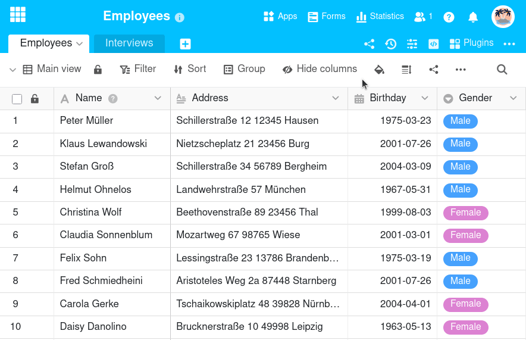

Wie in Europa und vielen anderen Regionen üblich, nutzt SeaTable standardmäßig **Montag** als ersten Tag der Woche. Je nachdem, in welchem Land Sie wohnen, gilt aber womöglich Samstag oder Sonntag als **erster Tag der Woche**. Daher können Sie SeaTable an Ihre regionalen Gegebenheiten anpassen: In den **Datumseinstellungen** lässt sich der erste Tag der Woche für jede Base individuell einstellen.


Datumseinstellungen einer Base, die zu einer Gruppe gehört, können **ausschließlich Eigentümer** und **Administratoren** bearbeiten. Einfachen Gruppenmitgliedern werden die Datumseinstellungen **nicht** angezeigt.


## Den ersten Tag der Woche in einer Base ändern

1. Öffnen Sie die **Base**, deren Datumseinstellungen Sie bearbeiten möchten.
2. Klicken Sie auf die **drei Punkte** im Base-Header.
3. Gehen Sie auf **Einstellungen** und dann auf **Datumseinstellungen**.
4. Wählen Sie im neuen Fenster aus, welcher Wochentag **der erste Tag der Woche** sein soll.
5. **Schließen** Sie im Anschluss das Fenster. Ihre vorgenommenen Einstellungen werden automatisch **gespeichert**.

## Wirkungsbereich der Datumseinstellungen

Eine Anpassung in den Datumseinstellungen führt dazu, dass im Kalendersteuerelement von [Datum-Spalten]() der gewählte Tag in die erste Spalte rückt. Dies gilt für die aktuell geöffnete Base und für alle auf ihr basierenden Apps.

Im [Kalender-Plugin]() sowie auf der [Kalenderseite in der App]() können Sie den ersten Tag der Woche allerdings weiterhin individuell und unabhängig von der Einstellung in der Base konfigurieren.