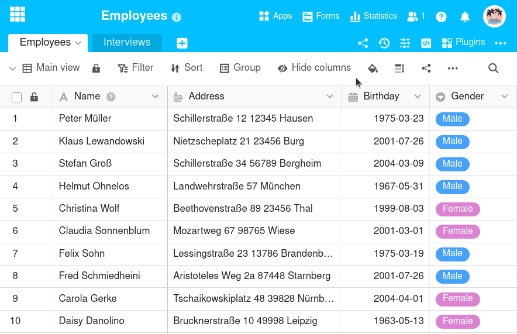

Tal como é comum na Europa e em muitas outras regiões, o SeaTable utiliza **segunda-feira** como o primeiro dia da semana por defeito. No entanto, dependendo do país em que vive, o sábado ou o domingo pode ser o **primeiro dia da semana**. Por conseguinte, pode adaptar o SeaTable às suas circunstâncias regionais: Nas **Definições de data**, o primeiro dia da semana pode ser definido individualmente para cada base.


Apenas os **proprietários** e **administradores** podem editar as definições de data de uma base que pertença a um grupo. Os simples membros do grupo **não** verão as definições de data.


## Alterar o primeiro dia da semana numa base

1. Abra a **base** cujas definições de data pretende editar.
2. Clique nos **três pontos** no cabeçalho da base.
3. Aceda a **Configurações** e depois a **Configurações de data**.
4. Na nova janela, selecione o dia da semana que deve ser **o primeiro dia da semana**.
5. Depois **feche** a janela. As definições que efectuou são automaticamente **gravadas**.

## Âmbito das definições de data

Um ajuste nas definições de data faz com que o dia selecionado passe para a primeira coluna no controlo de calendário de [Colunas de data](). Isto aplica-se à base atualmente aberta e a todas as aplicações nela baseadas.

No [Plugin de calendário]() e na [Página de calendário na aplicação](), no entanto, pode ainda configurar o primeiro dia da semana individualmente e independentemente da definição na base.