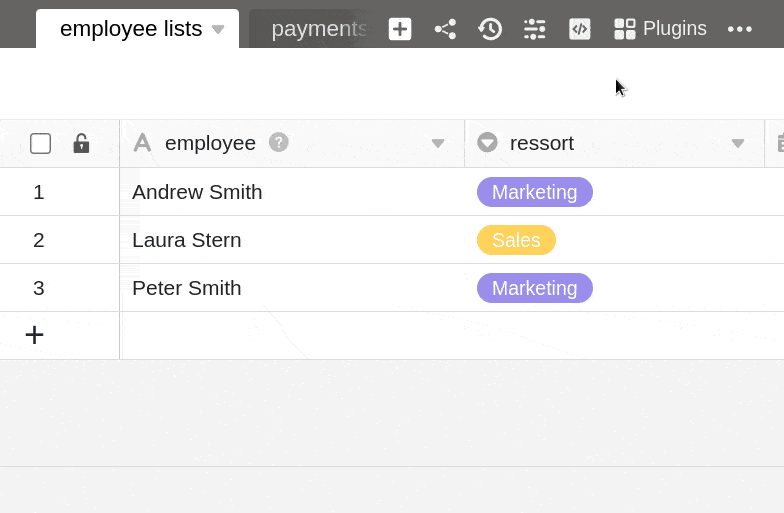
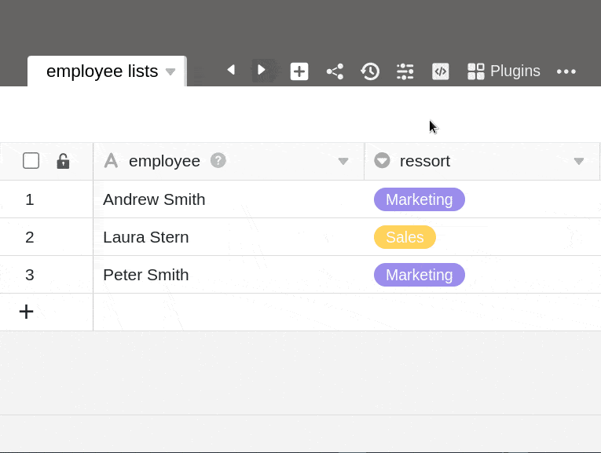



С помощью SeaTable вы можете привнести больше цвета в свою повседневную работу - особенно по сравнению с унылыми базами данных и скучными электронными таблицами. При [подписке Enterprise]() можно даже добавлять **свои собственные цвета** с помощью шестнадцатеричного кода в цветовую палитру, которая встречается в различных местах базы.

Например, вы можете выделить цветом [опции выбора](), [ячейки таблицы]() и [кнопки]() в соответствии с корпоративным дизайном или дать волю своему творчеству в цветовом оформлении.



## Добавьте свои собственные цвета

1. Нажмите на **три точки** в заголовке базы.
2. Перейдите в раздел " **Настройки**".
3. Выберите **настройки цвета**.
4. Нажмите на **символ \[+\]** на вкладке _Мои цвета_.
5. Выберите любой цвет из **палитры** цветов в качестве цвета **фона** _или_ добавьте пользовательский цвет с помощью **шестнадцатеричного кода** в палитру цветов.
6. Выберите черный или белый **цвет шрифта**.
7. Подтвердите нажатием кнопки **Сохранить**, а затем снова нажмите кнопку **Сохранить**, чтобы сохранить новый добавленный цвет.

## Редактировать цвета

Цвета, добавленные к основе, могут быть **скорректированы** в любое время с помощью того же метода.

1. Нажмите на **три точки** в заголовке базы.
2. Перейдите в раздел " **Настройки**".
3. Выберите **настройки цвета**.
4. Нажмите кнопку **Редактировать** на вкладке _Мои цвета_.
5. Нажмите на **цвет**, который вы хотите изменить.
6. Выберите **новый фон и цвет шрифта**.
7. Подтвердите изменения кнопкой **Сохранить**, а затем снова нажмите **Сохранить**, чтобы сохранить изменения.

## Удалить цвета

Вы можете **удалить** цвета, добавленные в базу, в любое время, используя тот же метод.

1. Нажмите на **три точки** в заголовке базы.
2. Перейдите в раздел " **Настройки**".
3. Выберите **настройки цвета**.
4. Нажмите кнопку **Редактировать** на вкладке _Мои цвета_.
5. Нажмите на **символ x** у цвета, который вы хотите удалить.
6. Подтвердите удаление с помощью кнопки **Сохранить**.



В настоящее время в SeaTable Cloud **нет** возможности задать свой собственный цвет для базы (заголовок базы, значок базы на главной странице) или [веб-формы](). Здесь вы можете выбрать только один из **12** предопределенных **цветов**.


