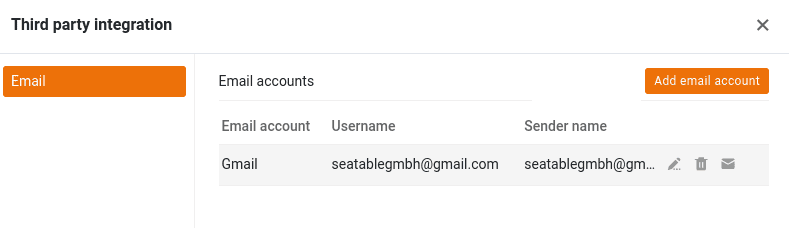

Eine der unzähligen Möglichkeiten, die Ihnen in SeaTable zur Verfügung stehen, ist das **Versenden von E-Mails** aus Ihren Bases. Diese Funktion von SeaTable bietet Ihnen eine beachtliche Zeitersparnis, wenn Sie zu einem bestimmten Zeitpunkt in einem Prozess immer bestimmte E-Mails versenden möchten – zum Beispiel eine Zahlungserinnerung, sobald die Frist für das Begleichen einer Rechnung überschritten ist.

Welche Schritte nötig sind, um ein E-Mail-Konto einer Base hinzuzufügen, und wie Sie im Anschluss E-Mails aus Ihrer Base versenden können, ist Gegenstand dieses Artikels.

## Ein E-Mail-Konto in Ihrer Base einrichten

1. Öffnen Sie die erweiterten Base-Optionen mit einem Klick auf das **Drei-Punkte-Icon** .
2. Wählen Sie die Option **Integration von Drittanbietern**.
3. Klicken Sie auf **E-Mail-Konto hinzufügen**.
4. Wählen Sie den passenden **Dienstanbieter** aus.
5. Geben Sie die für den jeweiligen Dienstanbieter geforderten Daten ein.

{{< warning  type="warning" headline="E-Mail-Konto ist nicht gleich E-Mail-Konto"  text="**Google und Microsoft** erlauben es nicht mehr, dass sich E-Mail-Anwendungen mit Benutzername und Passwort anmelden. Gmail erlaubt die Authentifizierung mittels App-Passwort oder via OAuth 2.0. Bei den Microsoft Produkten Microsoft 365 und Outlook ist nur die Authentifizierung via OAuth 2.0 möglich. Wenn Sie einen dieser beiden Anbieter verwenden wollen, dann wählen Sie diesen als Dienstanbieter aus. Wenn Ihr E-Mail-Anbieter die Authentifizierung über Benutzername und Passwort unterstützt, wählen Sie **Generischer E-Mail-Provider**." />}}

Um die Kontoeinrichtung zu erleichtern, bieten wir für die populärsten E-Mail-Provider Schritt-für-Schritt-Anleitungen:

- [Gmail](https://seatable.io/docs/integrationen-innerhalb-von-seatable/gmail-fuer-den-versand-von-e-mails-per-smtp-einrichten/)
- [GMX und WEB.DE](https://seatable.io/docs/integrationen-innerhalb-von-seatable/gmx-oder-web-de-fuer-den-versand-von-e-mails-per-smtp-einrichten/)
- [Outlook und Microsoft 365](https://seatable.io/docs/integrationen-innerhalb-von-seatable/microsoft-365-fuer-den-versand-von-e-mails-per-smtp-einrichten/)

## Testen der E-Mail-Konfiguration

Nachdem Sie Ihrer Base erfolgreich ein E-Mail-Konto hinzugefügt haben, wird Ihnen das eingerichtete Konto in den erweiterten Base-Optionen unter **Integration von Drittanbieter** angezeigt. Hier können Sie mit nur wenigen Klicks eine **Test-E-Mail** an ausgewählte Empfänger versenden.

Klicken Sie dafür rechts neben Ihrem eingerichteten E-Mail-Konto auf das **Briefumschlag-Symbol**.

Definieren Sie anschließend **Betreff**, **Empfänger** und **Inhalt** der Test-E-Mail. Sie können sich beispielsweise selbst eine E-Mail an Ihre eigene E-Mail-Adresse schicken.

Wurde erfolgreich eine Verbindung zum E-Mail-Server aufgebaut, dann erscheint eine knappe Erfolgsmeldung und in dem angegebenen Empfängerpostfach sollte eine E-Mail vom konfigurierten E-Mail-Konto eingehen.

Wenn alles wie beschrieben geklappt hat, haben Sie Ihr E-Mail-Konto erfolgreich in SeaTable eingerichtet und können mit dem E-Mail-Versand per [Automation]() beginnen.

## E-Mail-Versand aus einer Base

Nachdem Sie Ihr E-Mail-Konto in einer Base hinzugefügt haben, stehen Ihnen **zwei** verschiedene Möglichkeiten für den Versand von E-Mails zur Verfügung:

- [E-Mail-Versand per Automation]()
- [E-Mail-Versand per Schaltfläche]()

Auf beiden Wegen definieren Sie eine standardisierte E-Mail, deren **Text für alle Empfänger und Datensätze gleich** bleibt. Daher eignet sich diese Funktion nicht für E-Mails, deren Inhalt von Fall zu Fall stark variiert. Sie können aber **Einträge** aus verschiedenen Spalten **zitieren**, beispielsweise den jeweiligen Namen in die Anrede oder die Auftragsnummer in den Betreff einfügen, um die jeweilige **E-Mail** ein Stück weit zu **personalisieren** und mit den Daten aus der betroffenen Zeile anzureichern.

## Häufige Fragen

**Nein**, die geheimen E-Mail-Zugangsdaten sind durch die Freigabe einer Base **nicht gefährdet**. Bei E-Mail-Konten, die sich mittels Benutzername und Passwort am E-Mail-Server anmelden, wird das Passwort nach der Einrichtung nicht mehr im Klartext angezeigt. Bei eingerichteten E-Mail-Konten mit OAuth 2.0 Authentifizierung werden weder ID noch Schlüssel angezeigt.

**Nein**, die einer Base eingerichteten E-Mail-Konten werden **nicht kopiert**. Wenn Sie eine Base in den Bereich _Meine Bases_ oder [in eine Gruppe]() kopieren, müssen Sie in der neuen Base die E-Mail-Konten **neu einrichten**.

**Nein**, die in einer Base eingerichteten E-Mail-Konten werden **nicht in die [DTABLE-Datei]() exportiert**.


