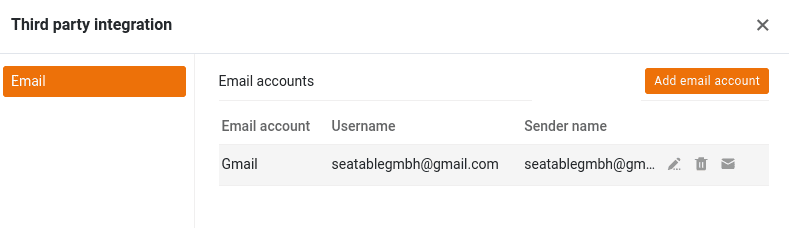
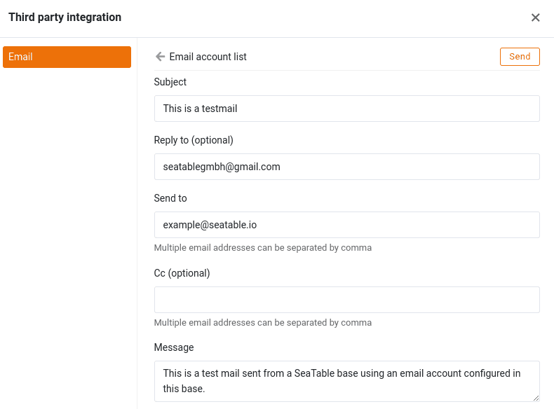

Uma das inúmeras opções ao seu dispor no SeaTable é o **envio de emails** a partir das suas bases. Esta funcionalidade do SeaTable poupa-lhe um tempo considerável se quiser enviar sempre certos e-mails num determinado momento do processo - por exemplo, um lembrete de pagamento assim que o prazo de pagamento de uma factura tiver passado.

Este artigo explica os passos necessários para adicionar uma conta de correio eletrónico a uma base e como pode então enviar mensagens de correio eletrónico a partir da sua base.

## Configure uma conta de e-mail na sua Base

1. Abra as opções da base alargada clicando no **ícone de três pontos** .
2. Selecione a opção **Integração de fornecedores terceiros**.
3. Clique em **Adicionar conta de correio eletrónico**.
4. Selecionar o **fornecedor de serviços** adequado.
5. Introduzir os dados necessários para o respetivo prestador de serviços.

{{< warning  headline="Nem todas as contas de correio eletrónico são iguais"  text="**A Google e a Microsoft** já não permitem que as aplicações de correio eletrónico iniciem sessão com um nome de utilizador e uma palavra-passe. O Gmail permite a autenticação utilizando uma palavra-passe de aplicação ou através de OAuth 2.0. Com os produtos Microsoft Microsoft 365 e Outlook, apenas é possível a autenticação através de OAuth 2.0. Se pretender utilizar um destes dois fornecedores, selecione-o como fornecedor de serviços. Se o seu fornecedor de correio eletrónico suportar a autenticação através do nome de utilizador e da palavra-passe, selecione **Fornecedor de correio eletrónico genérico**." />}}

Para facilitar a configuração da sua conta, oferecemos instruções passo a passo para os fornecedores de correio eletrónico mais populares:

- [Gmail]()
- [GMX e WEB.DE]()
- [Outlook e Microsoft 365]()

## Teste da configuração do e-mail

Após ter adicionado com sucesso uma conta de correio electrónico à sua Base, a conta que criou será exibida nas opções avançadas da Base sob **integração de terceiros**. Aqui pode enviar um **e-mail de teste** para destinatários seleccionados com apenas alguns cliques.

Para o fazer, clique no **símbolo do envelope** à direita da sua conta de e-mail configurada.

Em seguida, definir o **assunto**, o **destinatário** e o **conteúdo** do e-mail de teste. Por exemplo, pode enviar a si próprio um e-mail para o seu próprio endereço electrónico.

Se a ligação ao servidor de correio eletrónico tiver sido estabelecida com êxito, aparece uma breve mensagem de sucesso e uma mensagem de correio eletrónico da conta de correio eletrónico configurada deve chegar à caixa de correio do destinatário especificado.

Se tudo funcionou como descrito, criou com sucesso a sua conta de e-mail no SeaTable e pode começar a enviar e-mails através de [automatização]().

## Envio de correio electrónico a partir de uma base

Depois de ter adicionado a sua conta de e-mail numa Base, tem **duas** opções diferentes para o envio de e-mails:

- [Envio de e-mails por automatização]()
- [Envio de e-mail via botão]()

Em ambos os sentidos, define-se um e-mail normalizado cujo **texto** permanece o **mesmo para todos os destinatários e registos**. Por conseguinte, esta função não é adequada para e-mails cujo conteúdo varia muito de caso para caso. No entanto, pode **citar** **entradas** de diferentes colunas, por exemplo, inserir o respectivo nome na saudação ou o número de ordem no assunto, a fim de **personalizar** o respectivo **e-mail** em certa medida e enriquecê-lo com os dados da linha em questão.

## Perguntas mais frequentes

**Não**, os dados secretos de acesso ao correio eletrónico não são **postos em causa** pela libertação de uma base. Para as contas de correio eletrónico que iniciam sessão no servidor de correio eletrónico utilizando um nome de utilizador e uma palavra-passe, a palavra-passe deixa de ser apresentada em texto simples após a configuração. Para contas de correio eletrónico configuradas com autenticação OAuth 2.0, nem o ID nem a chave são apresentados.

**Não**, as contas de e-mail configuradas para uma base **não** são **copiadas**. Se copiar uma base para a área _As minhas bases_ ou [para um grupo](), tem de **configurar novamente** as contas de correio eletrónico na nova base.

**Não**, as contas de correio eletrónico configuradas numa base **não** são **exportadas para o [ficheiro DTABLE]()**.


