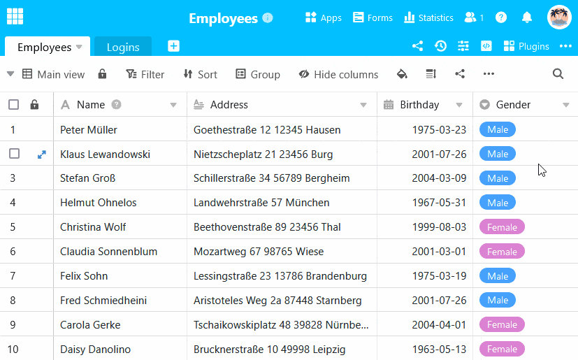
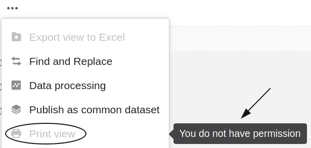
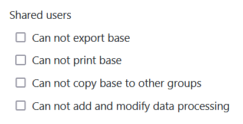

In the security settings of your base, you can make settings at any time that affect the security of your base and the protection of the data contained therein. The security settings apply specifically to a complete base and can differ from base to base depending on the settings made.



**Only** **owners** and **administrators** can edit the security settings of a base that belongs to a group. Simple group members do **not** see the security settings.



## Edit security settings of a base

1. Open the **base** whose security settings you want to edit.
2. Click on the **three dots** in the base header.
3. Go to **Settings** and then to **Security settings**.
4. In the new window, make the security settings for **All users** and **Shared users**.
5. Then **close** the window. The settings you have made will be **saved** automatically.

## Security settings: All users

The first part of the security settings relates to the authorizations of **all users** who have access to the corresponding base. You can make the following settings in this part:

### Prevent export of a base

By activating this setting, you can **prevent** other users from being able to [export](#base_exportieren) your base.

If this setting is **activated**, the base in question can no longer be exported by **anyone** until the setting is deactivated again by an owner or administrator. If a user nevertheless tries to export the corresponding base via the start page, the export is **prevented** and the following **error message** appears:

### Prevent printing of a base

By enabling this setting, you can **prevent** other users from [printing]() the different table views of your base.

If this setting is **activated**, the various table views of the affected base can no longer be printed by **anyone** until the setting is deactivated again by an owner or administrator. The corresponding option for printing in the view options is displayed **grayed out to** all users and can **no** longer be clicked. In addition, a **note** indicates that the users do **not have** permission to print the table views.

### Prevent copying a base to another group

By enabling this setting you can **prevent** other users from [copying base to another group]().

If this setting is **activated**, the base in question can no longer be copied by **anyone** to another group or to the _My bases_ area until the setting is deactivated again by an owner or an administrator. If a user nevertheless tries to copy the corresponding base via the start page, the copying process is **prevented** and the following **error message** appears:

### Prevent creation and modification of data processing operations

By activating this setting, you can **prevent** other users from creating, editing or deleting [data processing operations]().

If this setting is **activated**, the corresponding icons for adding, editing or deleting data processing operations are **hidden** until the setting is deactivated again by an owner or administrator. However, all users can still perform the existing data [processing operations]().

## Security settings: Shared users

The second part of the security settings refers to the permissions of the **users** to whom the corresponding [base]() is [shared](). In this part you can make the **same** settings that are already available in the first part for all users:

### Prevent export of a base

By activating this setting, you can **prevent** users to whom the corresponding [base](#base_exportieren) the base.

### Prevent printing of a base

By activating this setting you can **prevent** users to whom the corresponding [base]() the different table views of the base.

### Prevent copying a base to another group

By enabling this setting you can **prevent** users to whom the corresponding [base]() it to another group or to the _My bases_ section.

### Prevent creation and modification of data processing operations

By activating this setting, you can **prevent** users to whom the corresponding [base](). However, they can still [execute]() the existing data processing [operations]().
