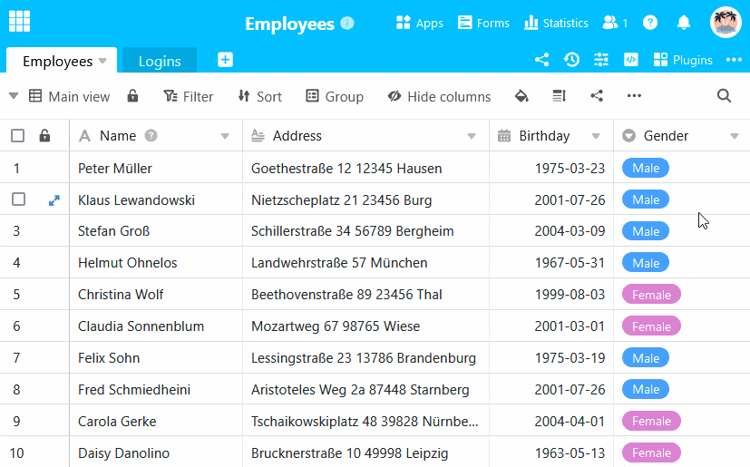
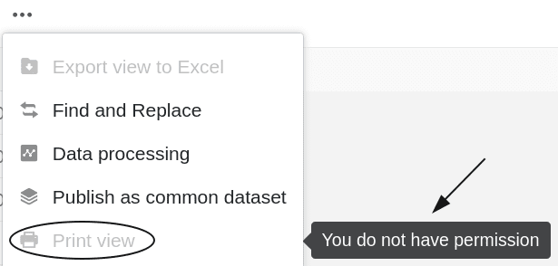
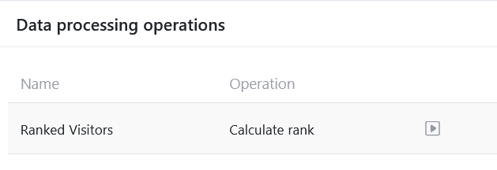
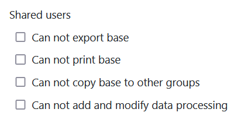

Dans les paramètres de sécurité de votre base, vous pouvez à tout moment procéder à des réglages qui concernent la sécurité de votre base et la protection des données qui s'y trouvent. Les réglages de sécurité sont spécifiques à une base complète et peuvent varier d'une base à l'autre en fonction des réglages effectués.



## Modifier les paramètres de sécurité d'une base

1. Ouvrez la **base** dont vous souhaitez modifier les paramètres de sécurité.
2. Cliquez sur les **trois points** dans l'en-tête de la base.
3. Allez dans **Paramètres**, puis dans **Paramètres de sécurité**.
4. Dans la nouvelle fenêtre, définissez les paramètres de sécurité pour **Tous les utilisateurs** et **Utilisateurs autorisés**.
5. **Fermez** ensuite la fenêtre. Les réglages que vous avez effectués sont automatiquement **enregistrés**.

## Paramètres de sécurité : Tous les utilisateurs

La première partie des paramètres de sécurité concerne les autorisations **de tous les utilisateurs** qui ont accès à la base correspondante. Dans cette partie, vous pouvez effectuer les réglages suivants :

### Empêcher l'exportation d'une base

En activant ce paramètre, vous pouvez **empêcher** que d'autres utilisateurs puissent [exporter](#base_exportieren) votre base.

Si ce paramètre **est activé**, la base concernée ne peut plus être exportée par **quiconque** jusqu'à ce qu'un propriétaire ou un administrateur désactive ce paramètre. Si un utilisateur tente malgré tout d'exporter la base en question via la page d'accueil, l'exportation est **bloquée** et le **message d'erreur** suivant apparaît :

### Empêcher l'impression d'une base

En activant ce paramètre, vous pouvez **empêcher** les autres utilisateurs d'[imprimer]() les différentes vues de tableau de votre base.

Si ce paramètre **est activé**, les différentes vues de tableau de la base concernée ne peuvent plus être imprimées par **personne** jusqu'à ce que le paramètre soit à nouveau désactivé par un propriétaire ou un administrateur. L'option d'impression correspondante dans les options d'affichage est affichée **en grisé** pour tous les utilisateurs et ne peut **plus** être cliquée. De plus, une **remarque** indique que les utilisateurs **n'** ont **pas** l'autorisation d'imprimer les vues du tableau.

### Empêcher la copie d'une base dans un autre groupe

En activant ce paramètre, vous pouvez **empêcher** d'autres utilisateurs de [copier]().

Si ce paramètre **est activé**, la base concernée ne peut plus être copiée par **quiconque** dans un autre groupe ou dans la section _Mes bases_, jusqu'à ce que le paramètre soit désactivé par un propriétaire ou un administrateur. Si un utilisateur tente malgré tout de copier la base concernée via la page d'accueil, le processus de copie est **interrompu** et le **message d'erreur** suivant apparaît :

### Empêcher la création et la modification d'opérations de traitement des données

En activant ce paramètre, vous pouvez **empêcher** les autres utilisateurs de créer, de modifier ou de supprimer [des opérations de traitement des données]().

Lorsque ce paramètre **est activé**, les icônes correspondantes permettant d'ajouter, de modifier ou de supprimer des opérations de traitement des données **sont masquées** jusqu'à ce qu'un propriétaire ou un administrateur désactive ce paramètre. Toutefois, tous les utilisateurs peuvent toujours effectuer les [opérations de traitement des données]() existantes.

## Paramètres de sécurité : Utilisateurs autorisés

La deuxième partie des paramètres de sécurité concerne les autorisations des **utilisateurs** avec lesquels la [base]() correspondante est [partagée](). Dans cette partie, vous pouvez effectuer **les mêmes** réglages que ceux qui sont déjà disponibles pour tous les utilisateurs dans la première partie :

### Empêcher l'exportation d'une base

En activant ce paramètre, vous pouvez **empêcher** les utilisateurs avec lesquels la [base](#base_exportieren) la base.

### Empêcher l'impression d'une base

En activant ce paramètre, vous pouvez **empêcher** les utilisateurs avec lesquels la [base]() les différentes vues de tableau de la base.

### Empêcher la copie d'une base dans un autre groupe

En activant ce paramètre, vous pouvez **empêcher** les utilisateurs avec lesquels la [base]() dans un autre groupe ou dans la zone _Mes bases_.

### Empêcher la création et la modification d'opérations de traitement des données

En activant ce paramètre, vous pouvez **empêcher** les utilisateurs avec lesquels la [base](). Cependant, ils peuvent toujours [exécuter les opérations de traitement de données]() existantes.
