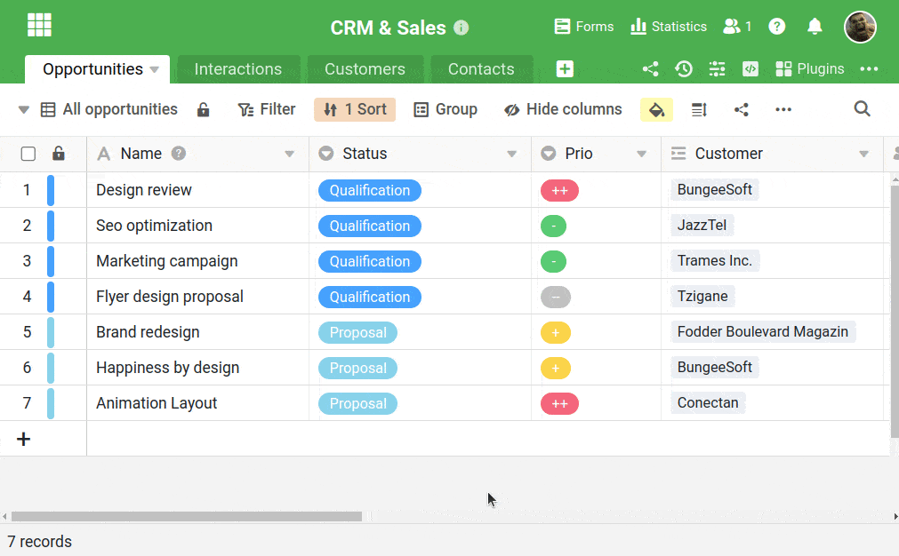

Se pretender dar a outros utilizadores "instruções de utilização" ou registar informações adicionais sobre uma base, pode adicionar uma descrição a uma base no SeaTable. A descrição abre automaticamente quando um utilizador abre a Base pela primeira vez.

## Acrescentar uma descrição a uma base

1. Clique no **símbolo de informação** directamente à direita do nome de uma base.
2. Abre-se uma máscara de entrada na qual se pode adicionar uma **descrição** à base.
3. As suas alterações são **automaticamente** guardadas quando fecha a máscara de entrada usando o **símbolo X** .
   
