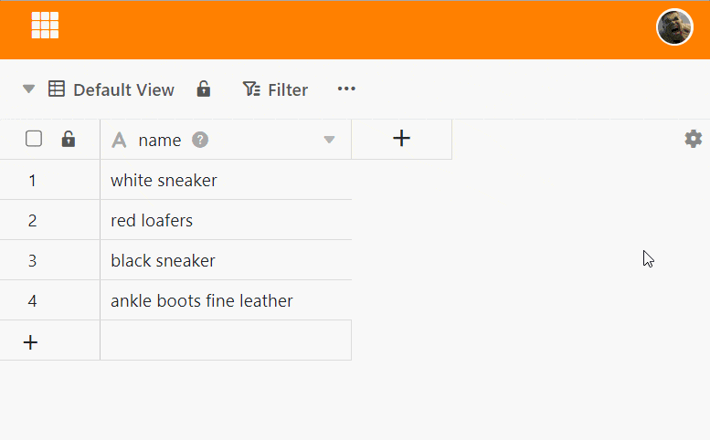
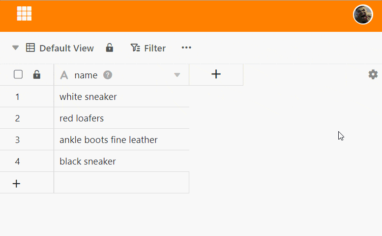

Puede cambiar el orden de las filas **arrastrando y soltando**. Si reordena las filas, SeaTable ajusta automáticamente la numeración.

## Para cambiar el orden de las filas

1. Haga clic en el **campo de numeración de** la fila que desea desplazar y mantenga **pulsado** el botón del ratón.
2. Arrastre la línea hasta la posición deseada. Una **línea** negra le indica el lugar al que saltará la línea.
3. Suelte el **botón del ratón** en cuanto la línea negra esté en la posición deseada.

## Mover varias líneas al mismo tiempo

También puede mover **varias filas** al mismo tiempo. Para ello, primero seleccione las filas. En el artículo [Seleccionar varias filas]() se explica cómo hacerlo. A continuación, desplace las filas del mismo modo que si se tratara de una sola fila.


