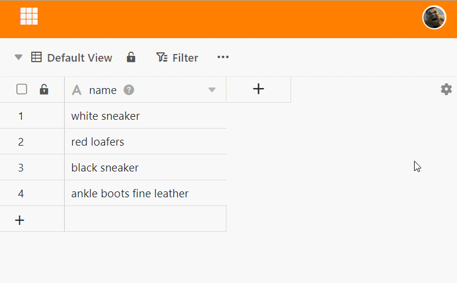
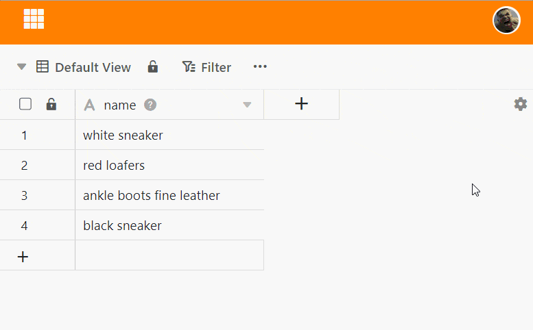

Вы можете изменить порядок следования строк, **перетаскивая** их. При изменении порядка следования строк SeaTable автоматически корректирует нумерацию.

## Чтобы изменить порядок следования строк

1. Щелкните в **поле нумерации** строки, которую нужно переместить, и удерживайте кнопку мыши **нажатой**.
2. Перетащите линию в нужное положение. **Черная линия** показывает, куда перейдет линия.
3. Отпустите **кнопку мыши**, как только черная линия окажется в нужном положении.

## Одновременное перемещение нескольких линий

Вы также можете перемещать **несколько рядов** одновременно. Для этого сначала выделите строки. Как это сделать, описано в статье [Выбор нескольких рядов](). Затем вы перемещаете строки так же, как и одну строку.



Если столбец [отсортирован]() (по возрастанию/по убыванию), вы можете перемещать записи, но порядок будет немедленно скорректирован.


