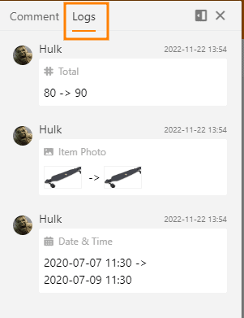

SeaTable poupa todas as alterações que são feitas numa base. Dentro de uma linha, o **registo da linha** oferece a possibilidade de rastrear exactamente quando o utilizador efectuou que alteração.

## O registo de linha

1. Mova o rato para o **campo de numeração** de uma linha e clique no **símbolo da seta dupla**.
2. Na janela aberta **Detalhes da Linha**, clicar no **símbolo da porta** quadrada no canto superior direito.
3. A janela expande-se. Clique em **Logs** à direita dos comentários.

  
No registo de linha encontrará, por ordem anticronológica, as mais recentes alterações feitas à linha. Cada entrada de registo contém as seguintes informações:

- Nome do editor
- Data da alteração
- Coluna afectada
- Descrição da alteração

## Mostrar e esconder os comentários e registos de uma linha

Por defeito, os **comentários** e **registos** são ocultados quando se abrem os **detalhes da linha**. Ao utilizar o pequeno **ícone de porta**, pode expandir esta área e exibir a informação.

## Diferenças entre o registo de linha e o registo de base

O **registo de linha** apenas lhe dá uma visão geral das alterações numa linha específica. Se, em vez disso, quiser ver todas as alterações de uma base, o [registo de base](https://seatable.io/pt/docs/historie-und-versionen/aenderungen-ueber-die-logs-rueckgaengig-machen/) ajudá-lo-á.
