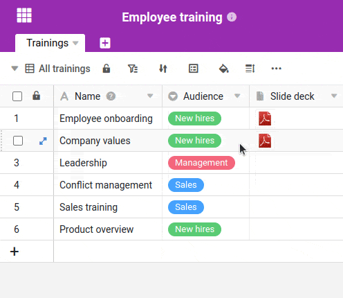

En este artículo aprenderás a **eliminar** una **fila**, **varias filas** y **entradas** de una fila.

## Borrar una línea

1. **Haga clic con el botón derecho del ratón** en una línea para abrir el **menú desplegable**.
2. Seleccione la opción **Borrar Fila**.



Antes de borrar una gran cantidad de datos, es aconsejable hacer una [instantánea de]() tu base.



## Borrar varias líneas

1. Mueva el ratón a la **columna de numeración**.
2. Seleccione las **filas** que desea eliminar marcando las **casillas de** las filas respectivas.
3. **Haga clic con el botón derecho del ratón** en cualquier lugar del área seleccionada para abrir el **menú desplegable**.
4. Seleccione la opción **Eliminar filas**.



## Borrar entradas de una línea

Puede eliminar la entrada de cualquier celda de una fila pulsando el botón **Seleccionar celda** y la entrada con el **Tecla de retroceso** o  Borrar

## Restaurar las líneas borradas

Si quieres restaurar una línea **borrada**, puedes encontrarla en la **papelera de reciclaje de la Base**. Aquí encontrarás todas las líneas eliminadas y podrás **restaurarlas** con un solo clic.

También puede utilizar la combinación de teclas  +  Deshaga sus últimas operaciones y restaure las filas eliminadas, siempre que no haya abandonado Base desde la eliminación.
