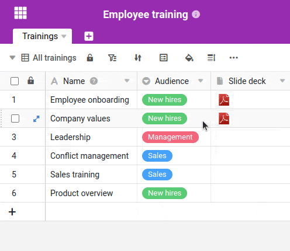
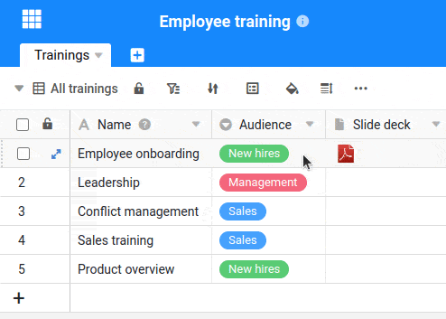
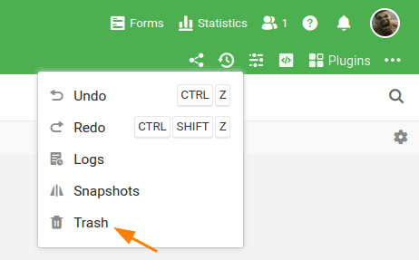

Neste artigo aprenderá como **eliminar** uma **única linha**, **várias linhas** e **entradas** de uma linha.

## Apagar uma linha

1. **Clique com o botão direito do rato** sobre uma linha para abrir o **menu pendente**.
2. Seleccionar a opção **Eliminar Fila**.



## Apagar várias linhas

1. Mova o rato para a **coluna de numeração**.
2. Seleccione as **linhas** que pretende apagar assinalando as **caixas das** respectivas linhas.
3. **Clique com o botão direito do rato** em qualquer lugar dentro da área seleccionada para abrir o **menu drop-down**.
4. Seleccionar a opção **Eliminar linhas**.



## Eliminação de entradas de uma linha

Pode apagar a entrada em qualquer célula de uma linha, clicando no **Seleccionar célula** e a entrada com o **Chave de backspace** ou  Eliminar

## Restaurar linhas apagadas

Se quiser restaurar uma **linha eliminada**, pode encontrá-la no **caixote da reciclagem de base**. Aqui encontrará todas as linhas eliminadas e pode **restaurá-las** com um clique.

Também pode utilizar a combinação de teclas  +  Desfaça as suas últimas operações e restabeleça as linhas eliminadas, desde que não tenha saído da Base desde a eliminação.
