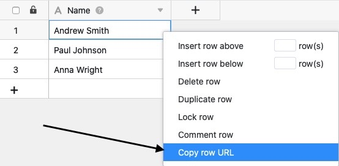
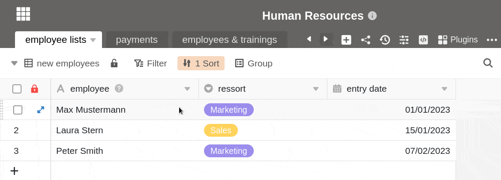

Jede Zeile einer Base hat eine eindeutige **URL**. Diese können Sie kopieren, wenn Sie exakt auf den Datensatz in einer bestimmten Zeile referenzieren möchten, beispielsweise um die Daten einem Teammitglied weiterzuleiten. Die URL kann allerdings nur von Personen geöffnet werden, die in SeaTable eingeloggt sind und Zugriff auf die Zeile haben.

Darüber hinaus können Sie aus der URL die [Zeilen-ID]() benötigen.

### Zum Kopieren einer Zeilen-URL stehen Ihnen zwei verschiedene Wege zur Verfügung:

- Kopieren der Zeilen-URL über das Kontextmenü
- Kopieren der Zeilen-URL über die Zeilendetails

## So kopieren Sie die Zeilen-URL über das Kontextmenü

1. Öffnen Sie eine beliebige **Tabelle**.
2. Klicken Sie auf die **Zeile**, deren URL Sie kopieren möchten.
3. Führen Sie einen **Rechtsklick** aus, um das Kontextmenü zu öffnen.
4. Klicken Sie auf **Zeilen-URL kopieren**.
   Nach dem erfolgreichen Kopieren der Zeilen-URL erscheint am oberen Seitenrand folgende **Erfolgsmeldung**:

## So kopieren Sie die Zeilen-URL über die Zeilendetails

1. Öffnen Sie eine beliebige **Tabelle**.
2. Öffnen Sie die **Zeilendetails**, indem Sie auf das **Doppelpfeil-Symbol** neben der Nummer einer Zeile klicken, deren URL Sie kopieren möchten.
3. Klicken Sie auf das **Link-Symbol** neben der Überschrift "Zeilendetails", um die **Zeilen-URL** zu kopieren.


