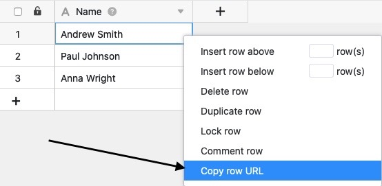
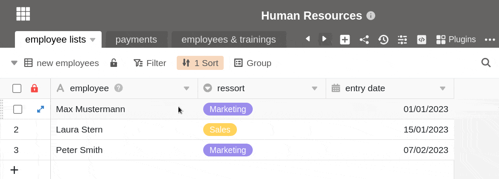

Cada fila de una Base tiene una **URL** única. Puede copiarla si desea hacer referencia al registro exacto de una fila en particular, por ejemplo para reenviar los datos a un miembro del equipo. Sin embargo, la URL sólo puede ser abierta por personas que hayan iniciado sesión en SeaTable y tengan acceso a la fila.

Además, puede leer el [ID de línea](), por ejemplo.

### Hay dos formas diferentes de copiar una URL de línea:

- Copiar la URL de la línea a través del menú contextual
- Copiar la URL de la fila a través de los detalles de la fila

## Para copiar la URL de la línea a través del menú contextual

1. Abre cualquier **mesa**.
2. Haga clic en la **línea** cuya URL desea copiar.
3. **Haga clic con el botón derecho del ratón** para abrir el menú contextual.
4. Haga clic en **Copiar URL de fila**.

Tras copiar correctamente la URL de la línea, aparece el siguiente **mensaje de éxito** en la parte superior de la página:

## Para copiar la URL de la fila a través de los detalles de la fila

1. Abre cualquier **mesa**.
2. Abra **los detalles de** la fila haciendo clic en el **símbolo de doble flecha** situado junto al número de una fila cuya URL desee copiar.
3. Haga clic en el **icono de enlace** situado junto al encabezado "Detalles de la fila" para copiar la **URL de la fila**.


