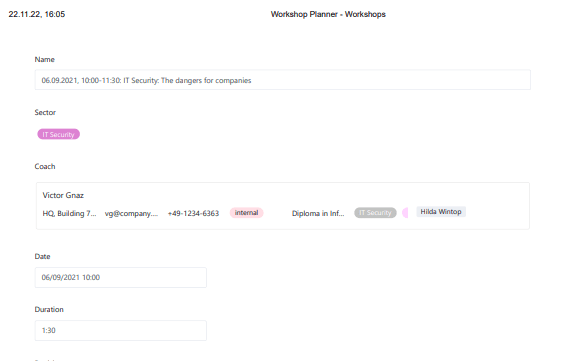
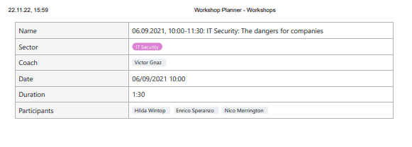

Tiene la opción de imprimir detalles **de fila** similares a [las](https://seatable.io/es/docs/grundlagen-von-ansichten/das-drucken-einer-ansicht/) vistas de tabla. A diferencia de la vista de tabla, los detalles de fila enumeran las columnas una debajo de otra (en lugar de una al lado de la otra) y proporcionan así un desglose más claro de los datos introducidos para una fila.

## Para imprimir líneas

1. Mueva el ratón hasta la numeración del **principio de la línea** que desea imprimir.
2. Haga clic en el **icono de doble flecha** para abrir **los detalles de la fila**.
3. En esta nueva ventana, haga clic en los **tres puntos** situados junto al título.
4. Seleccione la opción **Imprimir**.
5. Seleccione entre las opciones de impresión **Normal** y **Compacta** y haga clic en **Imprimir**.
6. Se abre la **ventana de impresión estándar de** su máquina. Aquí puede realizar otros ajustes y ver una vista previa de la impresión.
7. Complete la acción pulsando **Imprimir**.

También puede imprimir una línea abriendo los detalles de la línea y utilizando el método abreviado  +  uso.

## Presión compacta y normal

Los tipos de impresión **Normal** y **Compacto** difieren tanto en el tamaño del archivo como en la **presentación**.

- El **Presión normal** tiene un aspecto muy similar a la visualización habitual de los detalles de las filas: se ven las entradas como cabría esperar.  
   
- El **Presión compacta** reduce el espacio en blanco y empaqueta toda la información en una estructura de tablas.  
   


