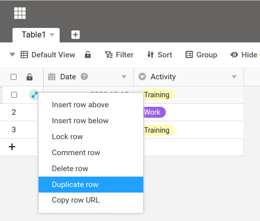

В SeaTable у вас есть различные возможности для дублирования строки. В этой статье вы можете узнать, какая процедура является лучшей в вашей ситуации.

## Дублирование по щелчку правой кнопкой мыши

Щелкните правой кнопкой мыши на строке и выберите в выпадающем меню опцию **Дублировать строку**. Создается новая строка с тем же содержимым.

## Дублирование строки несколько раз

Если вы хотите продублировать линию несколько раз, вы можете легко сделать это с помощью так называемой ручки заливки. Сначала создайте нужное количество пустых строк, например, с помощью комбинации клавиш +. Затем выберите нужный ряд и перетащите его в область **маленькая площадь** вниз в правом нижнем углу последней выделенной ячейки, чтобы создать нужные копии.

Вместо ручки заполнения вы также можете заполнить данные с помощью привычной комбинации клавиш + и + копия.
