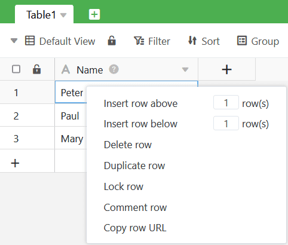
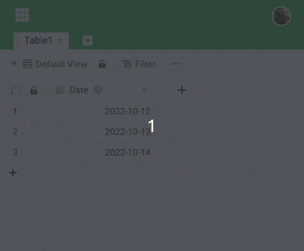

Hay varias formas de añadir una **nueva fila en** SeaTable. Usted aprenderá acerca de las diferentes posibilidades en este artículo.

## Formas de crear una nueva fila

La primera opción es hacer clic en el **símbolo más** de la **columna de numeración** situada en la esquina inferior izquierda de la tabla. Esto creará una nueva fila en blanco en la parte inferior de la tabla.

La segunda forma de insertar una nueva fila es **hacer clic con el botón derecho del ratón** en una fila y seleccionar **Insertar fila arriba/abajo** en el menú. En el pequeño campo de entrada puede determinar el número de filas que desea añadir.

Rápidamente **varias líneas nuevas** también puede utilizar la combinación de teclas  +  utilizar. Primero haga clic en **Línea**debajo de la cual desea insertar nuevas líneas. A continuación, mantenga pulsada la tecla **Tecla Shift** y pulse la tecla **Tecla Intro**para añadir rápidamente líneas vacías.

Además, algunos **plugins** de SeaTable ofrecen la opción de añadir nuevas entradas. Entre ellos se encuentran la [galería](https://seatable.io/es/docs/galerie-plugin/eine-neue-zeile-ueber-das-galerie-plugin-hinzufuegen/), el [calendario](https://seatable.io/es/docs/kalender-plugin/neue-kalendereintraege-im-kalender-plugin-anlegen/) y el [plugin Kanban](https://seatable.io/es/docs/kanban-plugin/anleitung-zum-kanban-plugin/).

## Por qué no se pueden crear nuevas líneas

¿No puede añadir una nueva fila en una tabla y no aparece el símbolo más? Entonces es probable que no disponga de los **permisos** adecuados en Base o View.

Por ejemplo, puede que se le hayan concedido derechos de sólo lectura en lugar de **derechos de lectura y escritura** al **compartir**. Si no tienes los derechos necesarios, ponte en contacto con el usuario que comparte o con un **administrador** de tu equipo.
