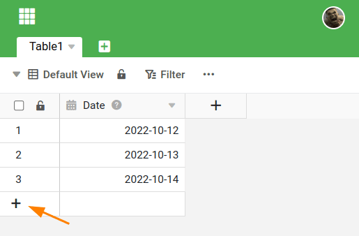

Il existe plusieurs façons d'ajouter une **nouvelle ligne** dans SeaTable. Vous découvrirez les différentes possibilités dans cet article.

## Comment créer une nouvelle ligne

La première possibilité consiste à cliquer sur le **symbole plus** dans la **colonne de numérotation** dans le coin inférieur gauche de votre tableau. Cela crée une nouvelle ligne vide en bas du tableau.

La deuxième possibilité d'insérer une nouvelle ligne consiste à cliquer avec **le bouton droit de la souris** sur une ligne et à sélectionner l'option **Insérer une ligne au-dessus/en dessous** dans le menu. Dans le petit champ de saisie, vous pouvez déterminer le nombre de lignes ajoutées.

Pour être rapide **plusieurs nouvelles lignes** vous pouvez également utiliser la combinaison de touches  +  utiliser pour cela. Cliquez d'abord sur une **Ligne**sous laquelle vous souhaitez insérer de nouvelles lignes. Maintenez ensuite la touche **Touche Majuscule** et appuyez plusieurs fois sur la touche **Touche Entrée**pour ajouter rapidement des lignes vides.

En outre, certains **plugins** de SeaTable offrent l'option d'ajouter de nouvelles entrées. Il s'agit notamment de la [galerie]() et du [plug-in Kanban]().

## Pourquoi vous ne pouvez pas créer de nouvelles lignes

Vous ne pouvez pas ajouter de nouvelle ligne dans un tableau et vous ne voyez pas le symbole plus ? Dans ce cas, vous ne disposez probablement pas des **autorisations** nécessaires dans la base ou la vue.

Par exemple, lors d'un **partage**, il se peut qu'on ne vous ait accordé que des droits de **lecture** au lieu de droits d'écriture. Si vous ne disposez pas des droits nécessaires, adressez-vous à l'utilisateur qui a effectué le partage ou à un **administrateur** de votre équipe.
