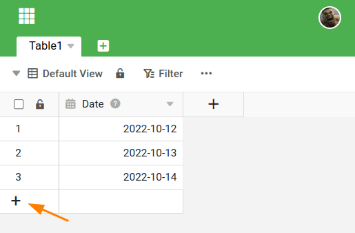
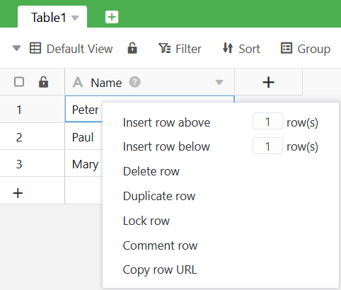
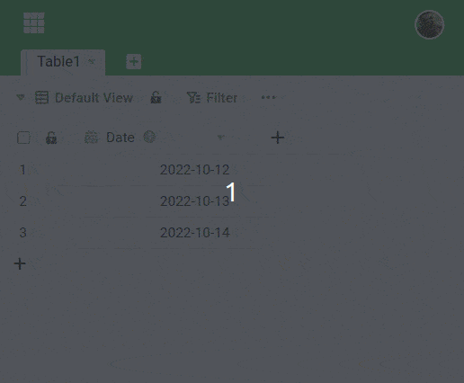

Há várias maneiras de acrescentar uma **nova fila no** SeaTable. Aprenderá sobre as diferentes possibilidades neste artigo.

## Formas de criar uma nova fila

A primeira opção é clicar no **símbolo de mais** na **coluna de numeração** no canto inferior esquerdo da sua mesa. Isto irá criar uma nova linha em branco na parte inferior da tabela.

A segunda maneira de inserir uma nova linha é **clicar com o botão direito do rato** numa linha e seleccionar **Insert Row Above/Below (Inserir Linha Acima/Baixo** ) no menu. No pequeno campo de entrada pode determinar o número de filas adicionadas.

Para rapidamente **várias novas linhas** também pode utilizar a combinação de teclas  +  utilização. Primeiro clique sobre um **Linha**sob as quais se pretende inserir novas linhas. Em seguida, segure a **Chave de turnos** pressionado e pressionado o **Introduzir chave**para adicionar rapidamente linhas vazias.

Além disso, alguns **plugins** do SeaTable oferecem a opção de adicionar novas entradas. Estes incluem a [galeria](https://seatable.io/pt/docs/galerie-plugin/eine-neue-zeile-ueber-das-galerie-plugin-hinzufuegen/), o [calendário](https://seatable.io/pt/docs/kalender-plugin/neue-kalendereintraege-im-kalender-plugin-anlegen/) e o [plugin Kanban](https://seatable.io/pt/docs/kanban-plugin/anleitung-zum-kanban-plugin/).

## Porque não se pode criar novas linhas

Não pode adicionar uma nova linha numa tabela e não é exibido nenhum símbolo de mais? Então provavelmente não tem as **permissões** apropriadas em Base ou Ver.

Por exemplo, podem ter-lhe sido concedidos direitos apenas de leitura em vez de **direitos de leitura-e-escrita** ao **partilhar**. Se não tiver os direitos necessários, contacte o utilizador que partilha ou um **administrador** na sua equipa.
